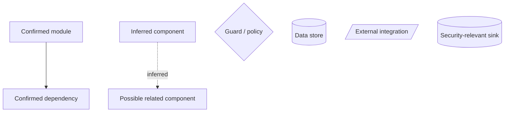
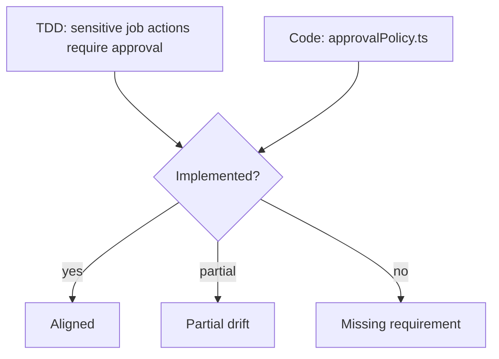

# Design Map And UX Workflow Plan

Generated: 2026-05-15

## Purpose

Owlvex should be able to build a project-local **Design Map** from the codebase and optional user-provided grounding files. The Design Map should explain how the application is structured, which boundaries exist, and where security-relevant flows pass through the code.

This plan also ties the Design Map into the UX workflow improvements already identified in [UX_WORKFLOW_CODE_ANALYSIS_20260515.md](UX_WORKFLOW_CODE_ANALYSIS_20260515.md).

The goal is not to create another AI-generated architecture essay. The goal is to create an evidence-backed project understanding layer that improves:

- first-use clarity
- scan targeting
- STRIDE/design-aware review
- false-positive reduction
- fix quality
- report usefulness

## Product Definition

### Design Box

The Design Box is user-provided context. It points to a local file such as:

- markdown/text
- Word `.docx`
- PDF `.pdf`
- architecture notes
- threat model notes
- product workflow documentation
- security assumptions

It tells Owlvex what the system is intended to do.

### TDD Box

The TDD Box is also user-provided context, but focused on expected behavior, requirements, and implementation constraints.

It tells Owlvex what behavior must be preserved.

### Drift Box

The Drift Box is a local, project-owned set of executable checks such as:

- `npm run validate`
- smoke tests
- contract tests
- behavior preservation scripts
- build plus unit/integration test scripts

It does not define security frameworks and does not block security scan completion. It produces pass/fail report evidence only.

### Design Map

The Design Map is generated by Owlvex from code plus optional Design/TDD context.

It should answer:

- what does this application do?
- where are the entrypoints?
- where are auth, authorization, validation, persistence, and external integrations?
- what are the trust boundaries?
- what ownership or tenant model is actually present?
- what does the code prove, infer, or leave uncertain?

## Diagram Box Direction

The single `Create Code Map` action is no longer the right product shape. Owlvex needs a **Diagram Box** workflow: one entry point that creates different local Mermaid diagrams for different jobs.

The Diagram Box should contain these diagram types:

- **Architecture Map**: a readable module/component map that shows entrypoints, major components, confirmed imports/calls, data stores, integrations, and security boundaries.
- **Security Evidence Map**: the current scanner-grounded map of files, guards, sinks, stores, and integrations. This is the evidence layer and should remain traceable to exact files.
- **Workflow Diagram**: a product/business flow such as user request -> auth -> approval -> job -> agent -> external system -> result. This is strongest when Design/TDD context exists.
- **TDD Diff Diagram**: a comparison between expected behavior in the TDD Box and actual code evidence. It should show implemented, missing, partial, extra, and contradicted behavior.
- **Threat Flow Diagram**: a STRIDE-category view of trust boundaries, entrypoints, sensitive operations, guards, and likely attack paths. It should separate Spoofing, Tampering, Repudiation, Information Disclosure, Denial of Service, and Elevation of Privilege instead of drawing one generic threat path.
- **Fix Impact Diagram**: a before/after view for a proposed or applied fix, showing the files/modules touched and the security flow changed.

The default user-facing diagram should be the readable Architecture Map. The Security Evidence Map should still be available because it is the defensible scanner artifact.

### Diagram Evidence Levels

Every node and edge in generated diagrams should declare or imply its evidence level:

- `confirmed_import_or_call`
- `confirmed_scanner_evidence`
- `confirmed_by_design_context`
- `confirmed_by_tdd_context`
- `inferred_from_folder_or_name`
- `uncertain`

Diagram output must not hide this distinction. A solid edge should mean a confirmed relationship. A dotted edge should mean inferred context. This matters because Owlvex must not turn a readable diagram into invented architecture.

Recommended legend:



### TDD Diff Diagram

The TDD Diff Diagram should compare user expectations against code evidence.

Model:

```text
TDD requirement -> Code evidence -> Status
```

Statuses:

- `Aligned`: the code clearly implements the TDD expectation.
- `Partial`: some evidence exists, but enforcement is incomplete.
- `Missing`: the TDD expectation has no corresponding code evidence.
- `Extra`: code implements behavior not described in the TDD.
- `Contradicted`: code appears to violate the TDD expectation.
- `Uncertain`: evidence is not strong enough to classify.

Example Mermaid shape:



The TDD Diff Diagram should be used as scan context only as grounding. It does not create deterministic proof by itself.

### Workflow Diagram

The Workflow Diagram should express how the application behaves from a user or system-event point of view. It should prefer:

- user/operator entrypoints
- authentication and authorization gates
- approval or policy checks
- job or command dispatch
- external integrations
- result persistence and feedback loops

This diagram is not a replacement for the evidence map. It is the developer-facing explanation layer.

## Design Map Output

Owlvex should continue to produce design-map artifacts, but the map should become one member of the Diagram Box rather than the only diagram capability.

Owlvex should produce these local artifacts:

- `owlvex-design-map.md` for users
- `owlvex-design-map.json` for the scanner/fix engine
- `owlvex-diagrams/architecture-map.md`
- `owlvex-diagrams/security-evidence-map.md`
- `owlvex-diagrams/workflow.md`
- `owlvex-diagrams/tdd-diff.md`
- `owlvex-diagrams/threat-flow.md`
- `owlvex-diagrams/fix-impact.md`

Both should stay under the selected project root. Neither should be uploaded to Owlvex Azure as source code.

Recommended markdown shape:

```md
# Owlvex Design Map

## Project Summary
## Entrypoints
## Main Modules
## Data Stores
## Authentication Model
## Authorization And Ownership Model
## Trust Boundaries
## Sensitive Data
## External Integrations
## Security-Relevant Flows
## Evidence Gaps
## Design Drift
## Scanner Guidance
```

The `Scanner Guidance` section is critical. It should provide compact constraints that the engine can use, for example:

- `tenantId` is a confirmed ownership boundary.
- role changes are expected to pass through `accessPolicy.canAssignRole`.
- report downloads should resolve paths through `reportCatalog`.
- no customer ownership model was found; do not invent `customerIds` or `managedCustomerIds`.
- outbound HTTP should use `fetchAllowedPartner`.

## Evidence Model

Every Design Map statement should carry confidence:

- `confirmed_by_code`
- `confirmed_by_design_context`
- `confirmed_by_tdd_context`
- `inferred_from_naming`
- `uncertain`
- `contradicted`

This matters because the Design Map must not become a hallucination source. If a relationship is only inferred, Owlvex should not use it to generate confident fixes.

## Scanner Integration

The Design Map should be used as a local context artifact for:

- STRIDE/design-aware scans
- repo-context AI scans
- fix preview generation
- report explanation
- prompt answers about the application

The Diagram Box should also feed STRIDE/design-aware scans. When STRIDE is selected and diagram artifacts exist, Owlvex should include bounded local context from:

- Architecture Map
- Workflow Diagram
- Threat Flow Diagram
- Security Evidence Map
- TDD Diff Diagram when available

This lets STRIDE review use generated diagrams even when the user has not supplied a separate TDD or design file. The diagrams remain grounding context, not deterministic proof.

It must not:

- create deterministic proof by itself
- suppress deterministic findings by itself
- invent authorization or ownership models
- upload project source/context to Owlvex backend

## False-Positive Guard

This is the strongest immediate value.

Before generating an authorization or ownership fix, Owlvex should check the Design Map for evidence of an ownership model.

Allowed to generate fix:

- ownership field exists in user/session/resource model
- policy helper exists
- repository method enforces scoped access
- design/TDD file explicitly defines the ownership rule
- route expectation documents the relationship

Route to manual review:

- only evidence is "request contains an ID"
- no ownership model exists in code or context
- fix would require new domain concepts
- proposed patch invents fields like `customerIds`, `managedCustomerIds`, or `isAdmin` without local evidence

This directly addresses the benchmark false-positive pattern where Owlvex inferred missing customer authorization and generated unsupported business logic.

## UX Workflow Integration

### Product Workflow Rule

Owlvex should present one simple working surface by default:

- provider/model selector
- scan scope selector
- Scan button
- Report button
- prompt box

Everything else is configuration or deeper context and must sit behind progressive disclosure. The cog drawer owns:

- Setup
- Context
- Advanced

The drawer must be hidden by default, including after webview refreshes, scan state refreshes, and extension reloads. This preserves space for the prompt and scan conversation. The user should not have to collapse setup controls repeatedly during daily use.

The bottom composer remains the primary working surface. It should not be moved into advanced settings because this is the part users already understand: choose provider, choose scope, scan, report, ask.

### Workflow State Machine

The UI should behave as a small state machine instead of a collection of unrelated buttons:

1. `Needs access`
2. `Needs project root`
3. `Needs provider`
4. `Ready to scan`
5. `Scan complete`
6. `Fix preview`
7. `Post-fix verification`
8. `Continue fixes or report`

Each state should expose one primary next action in the chat surface, not in the cog drawer. The drawer explains and edits configuration; the conversation area guides the current workflow.

### New User Path

The ideal first-use flow becomes:

1. install
2. register or enter licence
3. configure provider
4. select project root
5. optionally select TDD/Design/Drift
6. create or refresh Design Map
7. scan current file or changed files
8. inspect finding evidence
9. preview fix
10. keep/discard
11. see consolidated post-fix state
12. generate summary or evidence report

### Daily Developer Path

The daily path should be shorter:

1. code changes exist
2. Owlvex defaults to `Changed files` when Git changes are detected
3. scan uses existing Design Map if fresh enough
4. report separates:
   - findings touched by current diff
   - pre-existing findings in changed files
   - wider repo context
5. Drift Box runs only when configured and enabled

If Git is unavailable or the selected project root is not inside a Git repository, Owlvex should fall back cleanly:

- prefer selected files if present
- otherwise current file if open
- otherwise workspace scan with a clear warning

The user should never see a dead end such as "no changed files" without a next useful action.

### Prompt Path

When a user asks "what does this app do?", Owlvex should answer from:

- Design Map
- project root
- latest scan/report state
- active file
- configured Design/TDD context

If no Design Map exists, Owlvex should offer:

- `Create Design Map`
- `Scan current file`
- `Scan changed files`

## UI Changes

Add a compact **Project Understanding** area inside the cog drawer Context section:

- Design Map: missing/stale/current
- Design Box: configured/not configured
- TDD Box: configured/not configured
- Drift Box: configured/enabled/not configured

Commands:

- `Create Design Map`
- `Refresh Design Map`
- `Open Design Map`
- `Select Design Box File`
- `Select TDD Box File`
- `Select Drift Box Config`
- `Run Drift Checks Now`
- `Clear TDD Box`
- `Clear Design Box`
- `Clear Drift Box`

The scan scope dropdown should remain focused on what code is scanned:

- Current file
- Selected files
- Changed files
- Git commit/range
- Open editors
- Workspace

Project grounding should not be hidden inside security frameworks. Frameworks remain interpretation lenses; Design/TDD/Drift/Design Map are project grounding and validation surfaces.

### Pre-Scan Readiness Line

Before running a scan, Owlvex should be able to summarize the effective scan configuration in one compact line:

`Scope: Changed files | Frameworks: OWASP, STRIDE | Context: Design Map + TDD | Drift: on`

This line can appear in the conversation area or immediately above the scan composer. It should update when the user changes scan scope, frameworks, Design Map, TDD Box, Design Box, or Drift Box.

### Git Commit/Range Scan UX

When `Git commit/range` is selected:

- the prompt placeholder should change to `Paste commit hash, branch, tag, or range like main..HEAD`
- pressing Scan with an empty prompt should ask for the Git target
- a pasted commit hash in normal chat should route to the Git target scanner
- an empty result should distinguish:
  - target not found
  - target found but no files changed
  - target found but changed files are not scannable source

The empty result should list a small sample of skipped paths when useful.

### Reports After Scan

Report choice belongs after scan completion, not in the setup drawer. After a scan, the conversation card should offer:

- Summary report
- Full evidence report
- Preview fixes when findings are actionable

The bottom Report menu remains available for repeat use.

## Report Changes

Summary reports should include Design Map only when useful:

- `Design Map: current`
- `Design Map: stale`
- `Design Map: missing while STRIDE selected`
- `Design Box used: <path>`
- `TDD Box used: <path>`
- `Drift checks: passed/failed/skipped`

Full evidence reports should include:

- Design Map version/timestamp
- files used to generate it
- evidence gaps
- contradictions between design and code
- scanner guidance consumed by the scan

Reports should not mention Drift Box when it is not configured or not enabled.

## Implementation Slices

### Slice 1: Documentation And Product Contract

- Add this plan.
- Update UX workflow analysis.
- Update implementation backlog.
- Clarify that Design Map is generated context, while Design Box/TDD Box are user-provided context.

### Slice 2: Static Design Extractor

Build a local extractor that identifies:

- package/framework type
- entrypoints
- routes/controllers
- middleware
- service/repository files
- imports/exports
- environment/config usage
- sensitive APIs such as `fetch`, `fs`, `jwt`, `eval`, SQL clients, shell execution, logging

Output should be structured JSON with file references and confidence.

### Slice 3: Relationship Builder

Connect extracted evidence into relationships:

- route -> middleware -> handler
- handler -> service/repository
- source -> guard -> sink
- auth middleware -> route group
- policy helper -> protected action
- resource model -> ownership field

### Slice 4: Context Merger

Merge code evidence with:

- Design Box text
- TDD Box text
- existing project context
- selected framework lenses

Conflicts should be retained as `contradicted`, not silently resolved.

### Slice 5: Design Map Generator

Generate:

- user-readable markdown
- scanner-consumable JSON
- compact prompt summary

All statements should cite local evidence where possible.

### Slice 6: Scan And Fix Integration

Use Design Map as local context for:

- STRIDE
- repo-context AI review
- authorization/ownership false-positive gates
- fix-preview constraints
- prompt answers about the application

Reject or downgrade fixes that introduce domain concepts absent from the map.

### Slice 7: UX Integration

Add visible state and commands:

- Design Map status in chat/config card
- create/refresh/open actions
- stale indicator when files changed after map generation
- first-scan guidance that suggests creating a Design Map for repo-level/STRIDE review

### Slice 8: Report Integration

Add report sections and summary indicators.

Ensure Design Map evidence appears only when generated/used.

### Slice 9: Acceptance And Benchmarks

Acceptance checks:

- "what does this app do?" is answered from Design Map, not generic active-file guesses
- object ownership fixes are blocked when no ownership model exists
- STRIDE scan uses Design/TDD files and generated diagrams when available, and says when all design grounding is missing
- changed-files scan can use a fresh Design Map without rescanning the whole repo
- Drift Box remains report-only
- reports show Design/TDD/Drift only when configured or used

## Initial Delivery Order

1. Document the contract.
2. Add Design Map command scaffolding.
3. Implement static extractor for JavaScript/TypeScript Express-style projects.
4. Generate markdown and JSON artifacts.
5. Feed compact Design Map summary into chat and scan prompts.
6. Add false-positive gate for ownership/domain-model fixes.
7. Add report visibility.

This order gives product value before complex visualization work.
