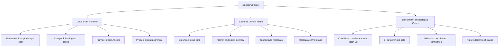

# Owlvex Implementation Backlog

This document turns [IMPLEMENTATION_DESIGN.md](D:/Dev/repos/CodeScanner/docs/IMPLEMENTATION_DESIGN.md) into an executable development backlog.

Use it as the delivery companion to the design contract:

- `IMPLEMENTATION_DESIGN.md` defines what Owlvex is allowed to be
- `IMPLEMENTATION_BACKLOG.md` defines what we need to build next

If there is a conflict, the design document wins and this backlog must be updated.

## Purpose

This backlog exists to keep implementation aligned with the intended product model:

- source code stays under customer control
- deterministic scanning runs locally
- Owlvex backend acts as a control plane, not a scan plane
- high-value grounded intelligence can be served from backend without requiring source upload

It is written so that a human engineer or Claude can pick up a workstream and execute it without re-deriving the architecture.

## Current Verified State

Verified via:

```bash
cd extension
npm run benchmark:status
```

Current benchmark-backed state:

- `19/19` suites passing
- `82/82` cases passing
- deterministic groups live:
  - execution-risk
  - sql-query
  - access-control
  - conditional-rules

Current product shape:

- extension scans code locally
- deterministic engine runs locally
- backend provides licence, prompt, catalog, and metadata services
- backend must not receive raw source code for scanning

## Build Principles

Every backlog item should preserve these invariants:

1. The extension is the execution plane.
2. The backend is the control plane.
3. Raw source code must not be required by the Owlvex backend.
4. Deterministic findings must remain benchmark-backed.
5. Product-facing findings must preserve provenance.

## Workstream Map



## Workstream 1: Protect The Data Boundary

### Goal

Make the local-vs-backend boundary explicit in code, configuration, and docs so it is difficult to accidentally turn Owlvex into a source-code relay.

### Tasks

- audit extension-to-backend payloads and confirm they contain metadata only
- document allowed and forbidden flows in product and engineering docs
- add guardrails in backend request handling to reject unexpected raw source-bearing payload shapes
- review logging paths in backend and extension to ensure raw source is not logged
- document provider-direct AI flow clearly in extension-facing docs and settings descriptions

### Likely Files

- [scanEngine.ts](D:/Dev/repos/CodeScanner/extension/src/scanner/scanEngine.ts)
- [backend](D:/Dev/repos/CodeScanner/backend)
- [IMPLEMENTATION_DESIGN.md](D:/Dev/repos/CodeScanner/docs/IMPLEMENTATION_DESIGN.md)
- [PRODUCT.md](D:/Dev/repos/CodeScanner/docs/PRODUCT.md)

### Acceptance Criteria

- backend does not require raw source code for prompt or rule delivery
- backend rejects or ignores source-bearing scan requests by design
- docs say clearly where code can and cannot go
- outbound provider behavior is explicit to the user

## Workstream 2: Backend-Served Rule And Config Delivery

### Goal

Move toward a model where the extension executes locally but can receive versioned grounded intelligence from the backend.

### Tasks

- define rule-pack/config payload shape
- decide what is bundled baseline vs fetched from backend
- add extension-side caching of last known good rule/config packs
- add versioning to backend-served rule/config metadata
- define integrity model for rule/config delivery
- document offline fallback behavior

### Likely Files

- [IMPLEMENTATION_DESIGN.md](D:/Dev/repos/CodeScanner/docs/IMPLEMENTATION_DESIGN.md)
- [backend](D:/Dev/repos/CodeScanner/backend)
- [extension/src](D:/Dev/repos/CodeScanner/extension/src)

### Acceptance Criteria

- extension can request grounded rule/config metadata without sending source code
- extension can cache and reuse rule/config data locally
- rule/config versions are explicit and traceable
- product behavior is defined for online and offline states

## Workstream 3: Product Output Alignment

### Goal

Make benchmark-backed deterministic findings and live product findings tell the same story.

### Tasks

- audit deterministic finding fields used by scan engine, report generator, and sidebar
- align product output with the benchmark normalized finding schema where practical
- document intentional differences between benchmark artifacts and extension-facing findings
- ensure deterministic findings preserve:
  - provenance
  - rule code
  - severity
  - canonical issue mapping when available

### Likely Files

- [scanEngine.ts](D:/Dev/repos/CodeScanner/extension/src/scanner/scanEngine.ts)
- [reportGenerator.ts](D:/Dev/repos/CodeScanner/extension/src/scanner/reportGenerator.ts)
- [sidebarProvider.ts](D:/Dev/repos/CodeScanner/extension/src/sidebarProvider.ts)
- [deterministic-finding-schema.md](D:/Dev/repos/CodeScanner/tools/owlvex-benchmark/deterministic-finding-schema.md)

### Acceptance Criteria

- deterministic finding semantics match between benchmark tooling and extension output
- users can tell what is proven versus inferred
- report output and sidebar output preserve rule identity and provenance

## Workstream 4: Conditional-Rule Benchmark Catch-Up

### Goal

Bring benchmark coverage in line with the live deterministic rules already implemented in the extension.

### Tasks

- add benchmark corpus and runners for `AC-T001`
- add benchmark corpus and runners for `DP-001`
- add benchmark corpus and runners for `SM-001`
- fold those suites into the aggregate deterministic gate
- update confidence and status docs once benchmark coverage matches live behavior

### Likely Files

- [corpus](D:/Dev/repos/CodeScanner/tools/owlvex-benchmark/corpus)
- [engine](D:/Dev/repos/CodeScanner/tools/owlvex-benchmark/engine)
- [run-deterministic.mjs](D:/Dev/repos/CodeScanner/tools/owlvex-benchmark/run-deterministic.mjs)
- [release-confidence.md](D:/Dev/repos/CodeScanner/tools/owlvex-benchmark/release-confidence.md)

### Acceptance Criteria

- every live deterministic conditional rule has benchmark coverage
- `benchmark:deterministic` reflects actual rule coverage, not a subset
- benchmark confidence claims match real implementation scope

## Workstream 5: CI And Release Discipline

### Goal

Make deterministic correctness part of the default shipping path rather than a manual check.

### Tasks

- run `benchmark:deterministic` in CI
- run key extension tests alongside the benchmark gate
- add a short release checklist referencing `benchmark:status`
- ensure failures are easy to diagnose from generated run artifacts

### Likely Files

- [.github/workflows](D:/Dev/repos/CodeScanner/.github/workflows)
- [package.json](D:/Dev/repos/CodeScanner/extension/package.json)
- [runs](D:/Dev/repos/CodeScanner/tools/owlvex-benchmark/runs)
- [release-confidence.md](D:/Dev/repos/CodeScanner/tools/owlvex-benchmark/release-confidence.md)

### Acceptance Criteria

- deterministic regressions block release by default
- release reviewers have one clear benchmark signal to inspect
- run artifacts are retained in a predictable format

## Workstream 6: Fourth Deterministic Axis

### Goal

Extend deterministic coverage carefully without weakening the existing ownership model.

### Candidate Areas

- secrets exposure
- security misconfiguration
- data protection / sensitive logging

### Tasks

- choose one axis only
- create contract doc
- create coverage plan
- add corpus with expected outputs
- add layered evaluators and integration runner
- fold the new axis into the aggregate deterministic gate

### Acceptance Criteria

- the new axis follows the same benchmark-backed contract discipline as existing axes
- no axis is added without contract, corpus, gate, and confidence updates

## Workstream 7: Azure Control Plane Readiness

### Goal

Prepare the backend for Azure deployment without changing the customer-code boundary.

### Tasks

- separate control-plane responsibilities from any accidental scan-plane behavior
- define production configuration for backend, database, secrets, and monitoring
- document Azure responsibilities:
  - licence
  - entitlement
  - issue catalog
  - prompt templates
  - rule/config metadata
  - scan metadata storage
- document what Azure must not do:
  - receive raw source for scanning
  - proxy source-bearing model calls
  - store raw source

### Acceptance Criteria

- Azure deployment plan preserves the same boundary as the local product model
- extension continues to run scanning locally
- backend remains metadata/config oriented

## Recommended Execution Order

1. protect the data boundary
2. backend-served rule and config delivery
3. product output alignment
4. conditional-rule benchmark catch-up
5. CI and release discipline
6. Azure control plane readiness
7. fourth deterministic axis

## Near-Term Priority Slice

If we want the smallest high-value delivery sequence, do this first:

1. finish conditional-rule benchmark catch-up
2. align benchmark deterministic findings with extension output fields
3. define rule/config pack shape for backend delivery
4. add local cache and version handling for that rule/config data

That sequence improves trust, product coherence, and IP posture without changing the data boundary.

## Definition Of Progress

We are making the right kind of progress when:

- new behavior is benchmarked before it is claimed
- extension and benchmark outputs become more consistent
- backend becomes more useful without becoming a scan proxy
- local execution becomes more capable without requiring source upload

## Definition Of Done For The Current Architecture Phase

This phase is complete when:

- the client/backend data boundary is enforced in code and docs
- benchmark coverage matches live deterministic rule coverage
- deterministic outputs are aligned across benchmark and product surfaces
- CI treats deterministic health as a release gate
- backend-served rule/config delivery is defined and locally consumable

At that point, Owlvex has moved from strong architecture plus benchmark tooling to a product implementation path that can scale safely.
