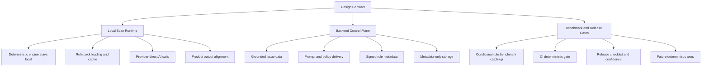

# Owlvex Implementation Backlog

This document turns [IMPLEMENTATION_DESIGN.md](D:/Dev/repos/CodeScanner/docs/IMPLEMENTATION_DESIGN.md) into an executable development backlog.

Use it as the delivery companion to the design contract:

- `IMPLEMENTATION_DESIGN.md` defines what Owlvex is allowed to be
- `IMPLEMENTATION_BACKLOG.md` defines what we need to build next

If there is a conflict, the design document wins and this backlog must be updated.

## Purpose

This backlog exists to keep implementation aligned with the intended product model:

- source code stays under customer control
- deterministic scanning runs locally
- Owlvex backend acts as a control plane, not a scan plane
- high-value grounded intelligence can be served from backend without requiring source upload

It is written so that a human engineer or Claude can pick up a workstream and execute it without re-deriving the architecture.

## Current Verified State

Verified via:

```bash
cd extension
npm run benchmark:status
```

Current benchmark-backed state:

- `19/19` suites passing
- `82/82` cases passing
- deterministic groups live:
  - execution-risk
  - sql-query
  - access-control
  - conditional-rules

Current product shape:

- extension scans code locally
- deterministic engine runs locally
- backend provides licence, prompt, catalog, and metadata services
- backend must not receive raw source code for scanning

## Build Principles

Every backlog item should preserve these invariants:

1. The extension is the execution plane.
2. The backend is the control plane.
3. Raw source code must not be required by the Owlvex backend.
4. Deterministic findings must remain benchmark-backed.
5. Product-facing findings must preserve provenance.

## Stabilization Execution Layer

The current scanner-hardening phase is governed by [STABILIZATION_CONTRACT.md](D:/Dev/repos/CodeScanner/docs/STABILIZATION_CONTRACT.md).

The next execution-shape contract for project grounding and explicit hybrid scan tiers is [PROJECT_CONTEXT_AND_SCAN_TIERS_CONTRACT.md](D:/Dev/repos/CodeScanner/docs/PROJECT_CONTEXT_AND_SCAN_TIERS_CONTRACT.md).

Benchmark source-of-truth files for that phase:

- [tools/demo/EXPECTATIONS.md](D:/Dev/repos/CodeScanner/tools/demo/EXPECTATIONS.md)
- [tools/demo-app/EXPECTATIONS.md](D:/Dev/repos/CodeScanner/tools/demo-app/EXPECTATIONS.md)

During stabilization, changes to AI normalization, report posture, confidence framing, and helper-context reasoning should be judged against those benchmark expectation files before broader issue-family expansion is considered.

The default benchmark refresh loop for this phase is:

```bash
cd extension
npm run benchmark:refresh-and-evaluate
```

That command is the practical "is the scanner still aligned with the expectation files?" gate for the current stabilization lane.

The current AI verification direction for stabilization is single-model, multi-pass corroboration:

- finder pass
- verifier pass
- skeptic pass

Those roles should be implemented first as one selected agent/model running three separate passes in sequence. The goal is to improve verification without requiring customers to provision multiple agents or heavyweight validation infrastructure.

Model/provider changes during this phase must be evaluated using [MODEL_SELECTION_MATRIX.md](D:/Dev/repos/CodeScanner/docs/MODEL_SELECTION_MATRIX.md) rather than by anecdotal scan quality alone.

The current hybrid scanner is being formalized, not replaced. Future implementation should move toward three explicit scan tiers:

- `STATIC`
- `TARGETED_AI`
- `REPO_AI`

and should support a client-side Project Context Contract that can ground AI reasoning without weakening the source-code privacy boundary.

## Workstream 0: Project Context And Scan Tiers

### Goal

Turn the current implicit hybrid scan model into an explicit three-tier system, and add a local project-context input path that helps AI understand the repo's goals, architecture, and trust boundaries.

### Tasks

- define first-class scan tier metadata in the scanner result model
- classify current scan paths as `STATIC`, `TARGETED_AI`, or `REPO_AI`
- define a local Project Context Contract format for user-supplied TDD-style context
- keep Project Context Contract data local by default
- ensure project context can be included only in AI-backed tiers, never as deterministic proof input
- surface scan tier visibly in reports, sidebar, and future scan summaries
- add benchmark or regression coverage to prevent tier labels from drifting silently

### Likely Files

- [scanEngine.ts](D:/Dev/repos/CodeScanner/extension/src/scanner/scanEngine.ts)
- [reportGenerator.ts](D:/Dev/repos/CodeScanner/extension/src/scanner/reportGenerator.ts)
- [sidebarProvider.ts](D:/Dev/repos/CodeScanner/extension/src/panels/sidebarProvider.ts)
- [chatViewProvider.ts](D:/Dev/repos/CodeScanner/extension/src/panels/chatViewProvider.ts)
- [PRODUCT.md](D:/Dev/repos/CodeScanner/docs/PRODUCT.md)
- [PROJECT_CONTEXT_AND_SCAN_TIERS_CONTRACT.md](D:/Dev/repos/CodeScanner/docs/PROJECT_CONTEXT_AND_SCAN_TIERS_CONTRACT.md)

### Acceptance Criteria

- scan results carry an explicit tier
- deterministic results map cleanly to `STATIC`
- bounded AI analysis paths map cleanly to `TARGETED_AI`
- broad exploratory AI paths map cleanly to `REPO_AI`
- project context remains local by default and never upgrades a finding to `PROVEN`
- users can tell from the UI/report what kind of scan produced a finding

## Workstream Map



## Workstream 1: Protect The Data Boundary

### Goal

Make the local-vs-backend boundary explicit in code, configuration, and docs so it is difficult to accidentally turn Owlvex into a source-code relay.

### Tasks

- audit extension-to-backend payloads and confirm they contain metadata only
- document allowed and forbidden flows in product and engineering docs
- add guardrails in backend request handling to reject unexpected raw source-bearing payload shapes
- review logging paths in backend and extension to ensure raw source is not logged
- document provider-direct AI flow clearly in extension-facing docs and settings descriptions

### Likely Files

- [scanEngine.ts](D:/Dev/repos/CodeScanner/extension/src/scanner/scanEngine.ts)
- [backend](D:/Dev/repos/CodeScanner/backend)
- [IMPLEMENTATION_DESIGN.md](D:/Dev/repos/CodeScanner/docs/IMPLEMENTATION_DESIGN.md)
- [PRODUCT.md](D:/Dev/repos/CodeScanner/docs/PRODUCT.md)

### Acceptance Criteria

- backend does not require raw source code for prompt or rule delivery
- backend rejects or ignores source-bearing scan requests by design
- docs say clearly where code can and cannot go
- outbound provider behavior is explicit to the user

## Workstream 2: Backend-Served Rule And Config Delivery

### Goal

Move toward a model where the extension executes locally but can receive versioned grounded intelligence from the backend.

### Tasks

- define rule-pack/config payload shape
- decide what is bundled baseline vs fetched from backend
- add extension-side caching of last known good rule/config packs
- add versioning to backend-served rule/config metadata
- define integrity model for rule/config delivery
- document offline fallback behavior

### Likely Files

- [IMPLEMENTATION_DESIGN.md](D:/Dev/repos/CodeScanner/docs/IMPLEMENTATION_DESIGN.md)
- [RULE_PACK_DELIVERY_CONTRACT.md](D:/Dev/repos/CodeScanner/docs/RULE_PACK_DELIVERY_CONTRACT.md)
- [backend](D:/Dev/repos/CodeScanner/backend)
- [extension/src](D:/Dev/repos/CodeScanner/extension/src)

### Acceptance Criteria

- extension can request grounded rule/config metadata without sending source code
- extension can cache and reuse rule/config data locally
- rule/config versions are explicit and traceable
- product behavior is defined for online and offline states

## Workstream 2A: Trusted Source Provenance

### Goal

Make Owlvex grounded data auditable so we can prove curated intelligence is based on trustworthy sources rather than undocumented generation.

### Tasks

- add provenance fields to issue, mapping, policy, and future remediation pack schemas
- require `sources[]`, `source_type`, `curation_method`, and `review_status` for curated entries
- add reviewer metadata such as `reviewed_by`, `reviewed_at`, and `last_verified_at`
- fail pack validation or release when required provenance is missing
- backfill existing issue and reasoning packs with source attribution and review state
- expose provenance state in internal validation and release outputs

### Likely Files

- [docs/schemas](D:/Dev/repos/CodeScanner/docs/schemas)
- [docs/data/issues](D:/Dev/repos/CodeScanner/docs/data/issues)
- [docs/data/stride](D:/Dev/repos/CodeScanner/docs/data/stride)
- [RULE_PACK_DELIVERY_CONTRACT.md](D:/Dev/repos/CodeScanner/docs/RULE_PACK_DELIVERY_CONTRACT.md)
- [PRODUCTION_READINESS_CONTRACT.md](D:/Dev/repos/CodeScanner/docs/PRODUCTION_READINESS_CONTRACT.md)

### Acceptance Criteria

- every production pack entry has auditable source attribution
- generated or AI-assisted content is explicitly marked and human-reviewed before release
- pack release fails when provenance requirements are not met
- Owlvex can distinguish source-backed curated guidance from unverified draft content

## Workstream 2B: Framework Source And Cheat Sheet Curation

### Goal

Turn external framework references into Owlvex-owned curated blobs that can ground AI prompts and remediation guidance more directly.

### Tasks

- maintain raw upstream framework mirrors under `docs/data/framework-sources/`
- maintain curated framework blobs under `docs/data/frameworks/`
- maintain curated cheat-sheet metadata under `docs/data/cheatsheets/`
- keep provenance and licensing notes explicit for mirrored vs reference-only sources
- define refresh scripts and a review workflow for source updates
- avoid using raw framework text dumps directly in prompts; prefer compact curated derivatives

### Likely Files

- [docs/data/framework-sources](D:/Dev/repos/CodeScanner/docs/data/framework-sources)
- [docs/data/frameworks](D:/Dev/repos/CodeScanner/docs/data/frameworks)
- [docs/data/cheatsheets](D:/Dev/repos/CodeScanner/docs/data/cheatsheets)
- [tools/download-framework-sources.mjs](D:/Dev/repos/CodeScanner/tools/download-framework-sources.mjs)
- [tools/build-owasp-cheatsheet-pack.mjs](D:/Dev/repos/CodeScanner/tools/build-owasp-cheatsheet-pack.mjs)

### Acceptance Criteria

- Owlvex has a versioned local source mirror for the key machine-readable framework inputs
- framework and cheat-sheet guidance is available as curated JSON blobs rather than only raw HTML/XLSX/ZIP sources
- reference-only sources are marked honestly where bulk mirroring is blocked or deferred
- the curation pipeline is reproducible from scripts, not just manual edits

## Workstream 2C: Runtime Grounding From Curated Packs

### Goal

Use the newly curated framework and cheat-sheet packs in the actual AI prompt path so runtime behavior becomes more grounded and less dependent on model memory.

### Tasks

- load framework blob guidance into prompt construction based on selected frameworks
- load relevant cheat-sheet guidance into remediation prompt context based on issue identity
- keep injected prompt context compact and issue-targeted
- add tests proving prompt construction changes when framework scope changes
- add tests proving remediation guidance can cite curated cheat-sheet actions without dumping raw source text

### Likely Files

- [scanEngine.ts](D:/Dev/repos/CodeScanner/extension/src/scanner/scanEngine.ts)
- [remediationResolver.ts](D:/Dev/repos/CodeScanner/extension/src/frameworks/remediationResolver.ts)
- [rulePackRegistry.ts](D:/Dev/repos/CodeScanner/extension/src/frameworks/rulePackRegistry.ts)
- [docs/data/frameworks](D:/Dev/repos/CodeScanner/docs/data/frameworks)
- [docs/data/cheatsheets](D:/Dev/repos/CodeScanner/docs/data/cheatsheets)

### Acceptance Criteria

- AI prompt construction uses curated framework guidance, not just framework names
- remediation prompts can use curated cheat-sheet guidance where relevant
- runtime output stays compact, provenance-aware, and validation-gated
- framework-guided AI behavior becomes more explainable and repeatable across runs

### Current Status

- selected framework scope is now injected from the curated framework blob at runtime
- deterministic-linked remediation now carries curated cheat-sheet guidance into the AI prompt path
- AI finding discussions surface framework-pack and cheat-sheet-pack provenance in the chat UI
- AI evals can now check framework scope and wording guardrails from generated reports
- next step is deeper issue-targeted grounding for AI-only findings and broader eval coverage for uncovered classes

## Workstream 3: Product Output Alignment

### Goal

Make benchmark-backed deterministic findings and live product findings tell the same story.

### Tasks

- audit deterministic finding fields used by scan engine, report generator, and sidebar
- align product output with the benchmark normalized finding schema where practical
- document intentional differences between benchmark artifacts and extension-facing findings
- ensure deterministic findings preserve:
  - provenance
  - rule code
  - severity
  - canonical issue mapping when available

### Likely Files

- [scanEngine.ts](D:/Dev/repos/CodeScanner/extension/src/scanner/scanEngine.ts)
- [reportGenerator.ts](D:/Dev/repos/CodeScanner/extension/src/scanner/reportGenerator.ts)
- [sidebarProvider.ts](D:/Dev/repos/CodeScanner/extension/src/sidebarProvider.ts)
- [deterministic-finding-schema.md](D:/Dev/repos/CodeScanner/tools/owlvex-benchmark/deterministic-finding-schema.md)

### Acceptance Criteria

- deterministic finding semantics match between benchmark tooling and extension output
- users can tell what is proven versus inferred
- report output and sidebar output preserve rule identity and provenance

## Workstream 3A: Review-First Remediation Flow

### Goal

Let Owlvex help users change code safely by turning grounded findings into reviewable candidate patches rather than silent auto-edits.

### Tasks

- define a finding-to-remediation discussion flow in advisory chat
- add a finding-focused action such as `Discuss this finding` or `Generate fix`
- pass the active finding, local snippet, and grounded remediation context into the advisory request
- define a patch proposal format that can be reviewed as a diff before apply
- require explicit user approval before any file edit is applied
- keep remediation generation local/provider-direct and never route source-bearing edit requests through Owlvex backend

### Likely Files

- [chatViewProvider.ts](D:/Dev/repos/CodeScanner/extension/src/panels/chatViewProvider.ts)
- [sidebarProvider.ts](D:/Dev/repos/CodeScanner/extension/src/sidebarProvider.ts)
- [extension.ts](D:/Dev/repos/CodeScanner/extension/src/extension.ts)
- [scanEngine.ts](D:/Dev/repos/CodeScanner/extension/src/scanner/scanEngine.ts)

### Acceptance Criteria

- users can start a remediation discussion from a concrete finding
- Owlvex can produce a candidate code change tied to the finding context
- users see a reviewable diff before apply
- file edits require explicit user approval
- the flow preserves the local-execution and metadata-only backend boundary

## Workstream 3B: Progressive Project-Context Expansion

### Goal

Improve AI trustworthiness by letting Owlvex expand from active-file analysis to nearby project context when single-file reasoning is not sufficient.

### Tasks

- define when AI flows should stay file-only versus when they should fetch additional local context
- gather nearby context such as imports, referenced local symbols, route/controller pairs, shared validators, and related framework files
- cap and prioritize fetched context so the experience stays fast and explainable
- surface which additional files or snippets informed an AI explanation or remediation proposal
- use expanded context for higher-risk or ambiguous findings before presenting stronger AI conclusions or candidate patches

### Likely Files

- [chatViewProvider.ts](D:/Dev/repos/CodeScanner/extension/src/panels/chatViewProvider.ts)
- [scanEngine.ts](D:/Dev/repos/CodeScanner/extension/src/scanner/scanEngine.ts)
- [workspaceScanner.ts](D:/Dev/repos/CodeScanner/extension/src/scanner/workspaceScanner.ts)
- [extension.ts](D:/Dev/repos/CodeScanner/extension/src/extension.ts)

### Acceptance Criteria

- file-only analysis remains the default fast path
- Owlvex can gather additional nearby project context when needed for trustworthy AI reasoning
- remediation and advisory responses can identify the context sources they used
- the expanded-context flow stays local/provider-direct and does not require source upload to Owlvex backend

## Workstream 4: Benchmark And Claim Maintenance

### Goal

Keep benchmark-backed claims, confidence docs, and product wording aligned as deterministic coverage evolves.

### Tasks

- keep benchmark status and product docs in sync when suites or case counts change
- update confidence and release docs whenever a deterministic group is added or promoted
- audit product wording so deterministic claims match benchmark-backed reality
- add a lightweight release check that compares docs claims against current benchmark status output

### Likely Files

- [PRODUCT.md](D:/Dev/repos/CodeScanner/docs/PRODUCT.md)
- [PRODUCTION_READINESS_CONTRACT.md](D:/Dev/repos/CodeScanner/docs/PRODUCTION_READINESS_CONTRACT.md)
- [release-confidence.md](D:/Dev/repos/CodeScanner/tools/owlvex-benchmark/release-confidence.md)
- [run-deterministic.mjs](D:/Dev/repos/CodeScanner/tools/owlvex-benchmark/run-deterministic.mjs)
- [.github/workflows](D:/Dev/repos/CodeScanner/.github/workflows)

### Acceptance Criteria

- benchmark confidence claims match real implementation scope
- current product docs do not describe stale benchmark coverage or outdated report behavior
- deterministic release wording is reviewed whenever benchmark status changes

## Workstream 5: CI And Release Discipline

### Goal

Make deterministic correctness part of the default shipping path rather than a manual check.

### Tasks

- run `benchmark:deterministic` in CI
- run key extension tests alongside the benchmark gate
- add a short release checklist referencing `benchmark:status`
- ensure failures are easy to diagnose from generated run artifacts

### Likely Files

- [.github/workflows](D:/Dev/repos/CodeScanner/.github/workflows)
- [package.json](D:/Dev/repos/CodeScanner/extension/package.json)
- [runs](D:/Dev/repos/CodeScanner/tools/owlvex-benchmark/runs)
- [release-confidence.md](D:/Dev/repos/CodeScanner/tools/owlvex-benchmark/release-confidence.md)

### Acceptance Criteria

- deterministic regressions block release by default
- release reviewers have one clear benchmark signal to inspect
- run artifacts are retained in a predictable format
- trusted-source provenance validation blocks release for grounded packs

## Workstream 6: Fourth Deterministic Axis

### Goal

Extend deterministic coverage carefully without weakening the existing ownership model.

### Candidate Areas

- secrets exposure
- security misconfiguration
- data protection / sensitive logging

### Tasks

- choose one axis only
- create contract doc
- create coverage plan
- add corpus with expected outputs
- add layered evaluators and integration runner
- fold the new axis into the aggregate deterministic gate

### Acceptance Criteria

- the new axis follows the same benchmark-backed contract discipline as existing axes
- no axis is added without contract, corpus, gate, and confidence updates

## Workstream 7: Azure Control Plane Readiness

### Goal

Prepare the backend for Azure deployment without changing the customer-code boundary.

### Tasks

- separate control-plane responsibilities from any accidental scan-plane behavior
- define production configuration for backend, database, secrets, and monitoring
- document Azure responsibilities:
  - licence
  - entitlement
  - issue catalog
  - prompt templates
  - rule/config metadata
  - scan metadata storage
- document what Azure must not do:
  - receive raw source for scanning
  - proxy source-bearing model calls
  - store raw source

### Acceptance Criteria

- Azure deployment plan preserves the same boundary as the local product model
- extension continues to run scanning locally
- backend remains metadata/config oriented

## Recommended Execution Order

1. protect the data boundary
2. backend-served rule and config delivery
3. product output alignment
4. conditional-rule benchmark catch-up
5. CI and release discipline
6. Azure control plane readiness
7. fourth deterministic axis

## Near-Term Priority Slice

If we want the smallest high-value delivery sequence, do this first:

1. keep benchmark claims and product docs aligned
2. align benchmark deterministic findings with extension output fields
3. define rule/config pack shape for backend delivery
4. add local cache and version handling for that rule/config data

That sequence improves trust, product coherence, and IP posture without changing the data boundary.

## Definition Of Progress

We are making the right kind of progress when:

- new behavior is benchmarked before it is claimed
- extension and benchmark outputs become more consistent
- backend becomes more useful without becoming a scan proxy
- local execution becomes more capable without requiring source upload

## Definition Of Done For The Current Architecture Phase

This phase is complete when:

- the client/backend data boundary is enforced in code and docs
- benchmark coverage matches live deterministic rule coverage
- deterministic outputs are aligned across benchmark and product surfaces
- CI treats deterministic health as a release gate
- backend-served rule/config delivery is defined and locally consumable

At that point, Owlvex has moved from strong architecture plus benchmark tooling to a product implementation path that can scale safely.
