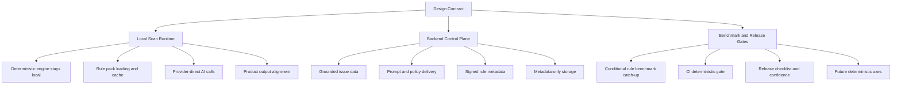

# Owlvex Implementation Backlog

This document turns [IMPLEMENTATION_DESIGN.md](D:/Dev/repos/CodeScanner/docs/IMPLEMENTATION_DESIGN.md) into an executable development backlog.

Use it as the delivery companion to the design contract:

- `IMPLEMENTATION_DESIGN.md` defines what Owlvex is allowed to be
- `IMPLEMENTATION_BACKLOG.md` defines what we need to build next

If there is a conflict, the design document wins and this backlog must be updated.

## Purpose

This backlog exists to keep implementation aligned with the intended product model:

- source code stays under customer control
- deterministic scanning runs locally
- Owlvex backend acts as a control plane, not a scan plane
- high-value grounded intelligence can be served from backend without requiring source upload

It is written so that a human engineer or Claude can pick up a workstream and execute it without re-deriving the architecture.

## Current Verified State

Verified via:

```bash
cd extension
npm run benchmark:status
```

Current benchmark-backed state:

- `19/19` suites passing
- `82/82` cases passing
- deterministic groups live:
  - execution-risk
  - sql-query
  - access-control
  - conditional-rules

Current product shape:

- extension scans code locally
- deterministic engine runs locally
- backend provides licence, prompt, catalog, and metadata services
- backend must not receive raw source code for scanning
- extension now supports a trial-oriented onboarding path for backend, licence, and provider configuration
- extension now supports lightweight email-based registration plus verification for Free and Trial so licences are issued only to a verified customer identity
- AI-backed findings now expose multi-pass corroboration detail through finder, verifier, and skeptic roles

## Build Principles

Every backlog item should preserve these invariants:

1. The extension is the execution plane.
2. The backend is the control plane.
3. Raw source code must not be required by the Owlvex backend.
4. Deterministic findings must remain benchmark-backed.
5. Product-facing findings must preserve provenance.

## Stabilization Execution Layer

The current scanner-hardening phase is governed by [STABILIZATION_CONTRACT.md](D:/Dev/repos/CodeScanner/docs/STABILIZATION_CONTRACT.md).

The next execution-shape contract for project grounding and explicit hybrid scan tiers is [PROJECT_CONTEXT_AND_SCAN_TIERS_CONTRACT.md](D:/Dev/repos/CodeScanner/docs/PROJECT_CONTEXT_AND_SCAN_TIERS_CONTRACT.md).

Benchmark source-of-truth files for that phase:

- [tools/demo/EXPECTATIONS.md](D:/Dev/repos/CodeScanner/tools/demo/EXPECTATIONS.md)
- [tools/demo-app/EXPECTATIONS.md](D:/Dev/repos/CodeScanner/tools/demo-app/EXPECTATIONS.md)

During stabilization, changes to AI normalization, report posture, confidence framing, and helper-context reasoning should be judged against those benchmark expectation files before broader issue-family expansion is considered.

Issue-family admission rule for this phase:

- no new issue family or major rule expansion should ship without:
- a benchmark expectation entry
- a safe companion or explicit negative case
- at least one regression test
- a false-positive guard when the class is prone to contextual overcalling

If one of those is missing, the issue family stays experimental and should not be presented as part of the trusted scanner surface.

The default benchmark refresh loop for this phase is:

```bash
cd extension
npm run benchmark:refresh-and-evaluate
```

That command is the practical "is the scanner still aligned with the expectation files?" gate for the current stabilization lane.

The current AI verification direction for stabilization is single-model, confidence-routed corroboration:

- finder pass
- verifier pass only when finder confidence, issue family, severity, or policy requires it
- skeptic pass only when verifier/finder disagreement or high-impact uncertainty means it can change the decision

Those roles should be implemented as one selected agent/model with distinct pass instructions. The goal is to improve verification without requiring customers to provision multiple agents or heavyweight validation infrastructure, while avoiding verifier/skeptic cost when the result is already clear enough.

Model/provider changes during this phase must be evaluated using [MODEL_SELECTION_MATRIX.md](D:/Dev/repos/CodeScanner/docs/MODEL_SELECTION_MATRIX.md) rather than by anecdotal scan quality alone.

The current hybrid scanner is being formalized, not replaced. Future implementation should move toward three explicit scan tiers:

- `STATIC`
- `TARGETED_AI`
- `REPO_AI`

and should support a client-side Project Context Contract that can ground AI reasoning without weakening the source-code privacy boundary.

## Current Phase Priorities

The next implementation phase should not treat language count as the main measure of product quality.

The current priority order is:

1. product hardening
2. bounded language expansion
3. issue-catalog and contract catch-up
4. platform security and trust-boundary hardening

Current operating decision for this phase:

- keep trials free
- move pricing implementation toward:
  - free
  - trial
  - developer
  - later teams
- keep billing disabled by default
- document billing-path security work now, but defer billing enablement work until the product is intentionally moved into a billable phase
- stop using Azure production as the day-to-day development environment
- establish Azure `dev` and Azure `prod` as separate hosted environments with separate resource groups and secrets

This ordering exists because Owlvex's deterministic floor is now materially stronger, but the overall product experience still has visible trust and UX gaps. The next phase should improve:

- conversation reliability and finding-state continuity
- fix-review clarity and verification behavior
- panel and workflow coherence
- scan observability for AI usage, token totals, throttling, and cost visibility
- language support only where the same proof discipline can be maintained

Language expansion is valuable, but it must follow the same bounded rule-contract discipline as issue-family expansion.

The current phase should also make demos and trials work without engineer hand-holding. That means:

- backend should be package-defaulted for dev/prod builds, with backend override available in-product when intentionally needed
- licence setup is visible in the shell
- provider setup is part of the normal workflow
- one setup check can confirm whether the trial path is ready
- day-to-day product work should now happen against Azure `dev`, including pricing, trial, and telemetry changes
- early customer entry should move away from anonymous licence distribution and toward email-based registration, verification, and tracked licence issuance

## Workstream 0.88: Pricing, Trial, And Usage Metering

### Goal

Turn the current free-trial / developer packaging into a real product contract backed by plan-aware licences and observable product-usage events.

### Tasks

- make `free`, `trial`, and `developer` first-class licence plans for dev and production seeding
- add a backend usage-event contract for product telemetry without weakening the metadata-only backend boundary
- emit extension-side usage events for key value moments:
  - `scan_run`
  - `finding_viewed`
  - `fix_viewed`
  - `second_scan`
  - `session_return`
- prepare free-tier and trial-tier enforcement from explicit plan features instead of ad hoc assumptions
- keep billing disabled while the free/trial path is being validated

### Current Direction

- backend now has a dedicated `/v1/usage/events` contract in the local worktree
- dev seed data now includes explicit `free`, `trial`, and `developer` licences
- extension command paths now emit basic usage events in the local worktree
- the next step after code merge is deploying the updated backend to Azure `dev` and validating the telemetry loop end to end

### Acceptance Criteria

- free, trial, and developer plans exist as real licence shapes
- usage events are recorded without requiring raw source upload
- extension scan/fix flows emit observable telemetry to the Owlvex control plane
- Azure `dev` is the default place to validate pricing and trial work before any production exposure

## Workstream 0.89: Customer Registration And Licence Issuance

### Goal

Move Free and Trial entry from manual or anonymous key handoff toward a lightweight email-registration model that lets Owlvex track issued licences and support early customers before marketplace or payment automation exists.

### Tasks

- define a lightweight customer registration contract using verified email as the primary identifier
- add backend customer/licence issuance flow for:
  - free
  - trial
  - later developer upgrades
- make the extension onboarding path ask for email registration and verification before Free or Trial licence issuance
- keep the first implementation intentionally light:
  - email registration
  - tracked licence issuance
  - extension-side licence storage
- add an internal ops/runbook path for manual support, resend, or recovery before payment automation exists
- add a fast read-only admin lookup surface for:
  - recent customers
  - pending registrations
  - licences by email
- extend the early admin surface with:
  - resend verification
  - licence deactivate
  - licence rotate by email
- keep marketplace discovery and billing out of scope for this workstream

### Acceptance Criteria

- Free and Trial entry can be tied to a verified email identity
- issued licences are traceable to a customer record
- a new user can register, receive a licence, and continue setup from inside the extension
- early customer support can recover or reissue a licence without ad hoc database edits
- the flow remains compatible with later marketplace and payment automation

## Workstream 0.90: AI Usage Accounting And Cost Visibility

### Goal

Make AI-backed scans observable enough that a user can understand why a scan was slow, how much model usage it consumed, and approximately what that usage cost.

### Tasks

- replace the current single optional token count with structured AI-usage accounting:
  - prompt/input tokens
  - completion/output tokens
  - total tokens
  - request count
  - provider/model identifiers
- accumulate usage across the full AI scan pipeline, not only the first response:
  - finder
  - verifier
  - skeptic
  - repo-context review passes
- expose aggregated usage on scan results so single-file and workspace scans can report:
  - AI requests made
  - total tokens used
  - scan duration
  - provider/model used
- distinguish budget pressure from actual provider throttling in user-facing warnings and reports
- add report and panel visibility for scan-level AI usage totals
- make cost estimation explicitly optional and model-aware:
  - do not claim exact cost until pricing metadata exists for the selected provider/model
  - if cost is shown, base it on structured usage totals rather than one collapsed token number

### Current Direction

- providers already return partial token usage metadata in the extension runtime
- the scan recorder currently stores only one `token_count` integer per scan record
- current report output does not show token usage, request counts, or estimated cost
- current scan-level accounting is not yet trustworthy for total-cost estimation because verifier, skeptic, and repo-context passes are not aggregated into one visible total

### Acceptance Criteria

- scan results expose aggregated AI usage totals for the full scan pipeline
- markdown reports show AI usage totals and make provider throttling versus budget truncation explicit
- users can estimate model spend from visible scan usage data without reverse-engineering provider logs
- product wording does not overclaim exact cost when provider pricing is unavailable, asymmetric, or subject to change

## Workstream 0.91: Confidence-Routed AI Corroboration

### Goal

Replace fixed finder/verifier/skeptic execution with an intelligent adjudication path that spends verifier and skeptic passes only when they can change the outcome.

This workstream exists because mass AI scanning is currently too slow and too throttle-prone when every candidate receives the same corroboration depth. Owlvex should retain the quality benefit of multi-pass reasoning without making skeptic a default third opinion for every finding.

### Product Rules

- deterministic findings own only the exact span/family they prove
- AI must not duplicate or re-verify deterministic findings
- a file with deterministic findings may still receive AI review for other spans and issue families
- finder confidence means confidence that a candidate exists
- verifier confidence means confidence in the verifier verdict
- skeptic confidence means confidence in the skeptic verdict
- reports must show verdict plus confidence, not naked role scores

### Tasks

- add a deterministic exclusion map:
  - line range
  - canonical issue id
  - canonical family
  - matched sink/source where available
- filter AI finder candidates against the deterministic exclusion map before corroboration
- change AI review data structures so verifier and skeptic scores are always attached to verdicts:
  - verifier: `support | reject | unclear | skipped`
  - skeptic: `clear | contradict | unclear | skipped`
- implement confidence routing:
  - high-confidence finder candidates can be kept without verifier unless family/severity policy requires review
  - medium-confidence finder candidates trigger verifier
  - very low finder confidence is dropped unless high-impact policy requires verifier
  - high-confidence verifier support keeps the candidate without skeptic unless policy requires challenge
  - verifier reject suppresses the candidate
  - skeptic runs only for disagreement, borderline verifier confidence, high-impact context-sensitive findings, or fix-triggering findings
- store pass route metadata on AI findings:
  - `finder`
  - `finder_verifier`
  - `finder_verifier_skeptic`
- record metadata-safe pass outcomes for kept and dropped AI candidates:
  - no raw source
  - file hash, span, issue id, verdicts, confidences, decision, route
- update report wording:
  - `Finder-only AI support`
  - `Verifier supported`
  - `Skeptic cleared`
  - `Verifier rejected`
  - `Skeptic contradicted`
  - `Partial / needs context`
- add regression tests for:
  - deterministic duplicate suppression while preserving non-overlapping AI findings
  - finder-high route skips verifier/skeptic
  - finder-medium route triggers verifier
  - verifier-strong-support route skips skeptic
  - verifier-low/reject route suppresses or demotes
  - finder/verifier disagreement triggers skeptic
  - report output includes verdict-specific confidence

### Initial Thresholds

These are starting defaults to validate against reports and benchmark data:

- finder `>= 0.90`: keep as AI-supported unless static duplicate, critical policy, or known false-positive family requires verifier
- finder `0.70-0.89`: run verifier
- finder `< 0.70`: drop unless severity, issue family, or local signals justify verifier
- verifier `support >= 0.90`: keep as corroborated
- verifier `support 0.60-0.89`: run skeptic when impact is high/critical, confidence spread is large, or family is false-positive prone
- verifier `reject >= 0.80`: drop
- verifier `unclear`: partial/manual review or skeptic only if high-impact and enough evidence exists

### Current Evidence

A first pass over local markdown reports found:

- 94 scan reports inspected
- 12 reports with AI findings
- 39 surviving AI findings with finder/verifier/skeptic scores
- 0 explicit verifier rejects in surviving report output
- 0 explicit skeptic contradictions in surviving report output
- 2 findings with verifier below 70%
- 2 findings with skeptic below 70%
- 24 reports with rate-limit or corroboration warnings

Interpretation:

- the reports only show surviving findings, so they cannot measure candidates dropped before report output
- skeptic is rarely changing visible outcomes in the current report set
- weak verifier/skeptic scores are sometimes still presented too confidently
- future implementation must record dropped-candidate pass outcomes before contradiction rate can be measured correctly

### Acceptance Criteria

- mass AI scans use fewer verifier/skeptic calls without losing visible high-risk AI findings in the demo and demo-app expectation sets
- deterministic findings are not re-reviewed by AI on the same span/family
- AI still reviews the rest of a file when static findings exist
- report wording makes the AI decision path clear
- role confidence is always tied to a verdict
- pass outcome telemetry is sufficient to answer "how often did verifier or skeptic change the decision?"

## Workstream 0.85: Benchmarking Department

### Goal

Turn benchmarking into a first-class department inside the repo rather than a scattered collection of scripts, corpora, and notes.

This workstream exists to make Owlvex's quality claims explicit across:

- deterministic proof
- AI quality
- recommended scan-tier fit
- release confidence
- external benchmark alignment

### Tasks

- define benchmark governance and methodology
- separate deterministic benchmark ownership from AI benchmark ownership
- define the client-facing benchmark story for `STATIC`, `TARGETED_AI`, and `REPO_AI`
- formalize how external benchmarks support Owlvex claims without replacing Owlvex-native evaluation
- keep benchmark docs, scripts, and manifests aligned with product truth

### Likely Files

- [docs/benchmarking/README.md](D:/Dev/repos/CodeScanner/docs/benchmarking/README.md)
- [docs/benchmarking/CHARTER.md](D:/Dev/repos/CodeScanner/docs/benchmarking/CHARTER.md)
- [docs/benchmarking/METHODOLOGY.md](D:/Dev/repos/CodeScanner/docs/benchmarking/METHODOLOGY.md)
- [docs/benchmarking/EXTERNAL_BENCHMARK_PLAN.md](D:/Dev/repos/CodeScanner/docs/benchmarking/EXTERNAL_BENCHMARK_PLAN.md)
- [docs/benchmarking/CLIENT_GUIDE.md](D:/Dev/repos/CodeScanner/docs/benchmarking/CLIENT_GUIDE.md)
- [docs/benchmarking/ROADMAP.md](D:/Dev/repos/CodeScanner/docs/benchmarking/ROADMAP.md)
- [tools/owlvex-benchmark/README.md](D:/Dev/repos/CodeScanner/tools/owlvex-benchmark/README.md)

### Acceptance Criteria

- benchmark governance is documented separately from implementation backlog detail
- Owlvex-native proof and AI benchmarks are clearly separated
- the repo has a client-readable benchmark explanation
- external benchmark adoption has a declared plan instead of ad hoc references

## Workstream 0.86: Canonical Remediation Fidelity

### Goal

Improve Owlvex canonical remediation so it matches trusted OWASP-style guidance more faithfully and becomes the primary contract for reports, chat, sidebar guidance, and fix generation.

This workstream exists because richer canonical remediation is a better long-term architecture than relying on raw cheat-sheet text injection at each prompt surface.

### Tasks

- enrich canonical remediation entries for high-value issue families with clearer safe patterns, unsafe alternatives, and validation steps
- tighten the mapping between canonical issue families and curated OWASP cheat-sheet guidance
- make framework-specific variants more consistent where the family behavior differs by language or framework
- use richer canonical remediation as the default grounding source for fix previews, not just explanation surfaces
- keep canonical remediation provenance auditable and benchmarkable

### Current Direction

- the canonical remediation resolver now carries richer normalized fields into chat and fix-discussion prompts:
  - recommended steps
  - validation guidance
  - unsafe alternatives
  - concise curated cheat-sheet grounding
- the next implementation slices should push the same richer contract further into:
  - fix benchmarking
  - sidebar UX
  - family-by-family remediation-pack fidelity reviews

### Likely Files

- [extension/src/frameworks/remediationResolver.ts](D:/Dev/repos/CodeScanner/extension/src/frameworks/remediationResolver.ts)
- [extension/src/frameworks/rulePackRegistry.ts](D:/Dev/repos/CodeScanner/extension/src/frameworks/rulePackRegistry.ts)
- [extension/data/remediation](D:/Dev/repos/CodeScanner/extension/data/remediation)
- [extension/data/cheatsheets](D:/Dev/repos/CodeScanner/extension/data/cheatsheets)
- [extension/src/panels/chatViewProvider.ts](D:/Dev/repos/CodeScanner/extension/src/panels/chatViewProvider.ts)
- [extension/src/scanner/reportGenerator.ts](D:/Dev/repos/CodeScanner/extension/src/scanner/reportGenerator.ts)

### Acceptance Criteria

- major canonical issue families carry richer normalized remediation guidance
- canonical remediation aligns more closely with curated OWASP guidance without dumping raw source text into product copy
- fix preview prompts consume canonical remediation as the primary grounded remediation contract
- report, sidebar, and chat surfaces stay consistent because they are reading the same richer canonical contract
- remediation quality can be benchmarked against declared family-level expectations

## Workstream 0: Project Context And Scan Tiers

### Goal

Turn the current implicit hybrid scan model into an explicit three-tier system, and add a local project-context input path that helps AI understand the repo's goals, architecture, and trust boundaries.

### Tasks

- define first-class scan tier metadata in the scanner result model
- classify current scan paths as `STATIC`, `TARGETED_AI`, or `REPO_AI`
- define a local Project Context Contract format for user-supplied TDD-style context
- keep Project Context Contract data local by default
- ensure project context can be included only in AI-backed tiers, never as deterministic proof input
- surface scan tier visibly in reports, sidebar, and future scan summaries
- add benchmark or regression coverage to prevent tier labels from drifting silently
- make the bottom working-scope dropdown the explicit AI context boundary as well as the scan target selector
- keep AI repo access aligned with visible scope modes such as `Active file`, `Selected files`, `Open editors`, and `Workspace`
- surface context provenance so users can tell whether an answer used active-file, nearby-file, or workspace context

### Likely Files

- [scanEngine.ts](D:/Dev/repos/CodeScanner/extension/src/scanner/scanEngine.ts)
- [reportGenerator.ts](D:/Dev/repos/CodeScanner/extension/src/scanner/reportGenerator.ts)
- [sidebarProvider.ts](D:/Dev/repos/CodeScanner/extension/src/panels/sidebarProvider.ts)
- [chatViewProvider.ts](D:/Dev/repos/CodeScanner/extension/src/panels/chatViewProvider.ts)
- [PRODUCT.md](D:/Dev/repos/CodeScanner/docs/PRODUCT.md)
- [PROJECT_CONTEXT_AND_SCAN_TIERS_CONTRACT.md](D:/Dev/repos/CodeScanner/docs/PROJECT_CONTEXT_AND_SCAN_TIERS_CONTRACT.md)

### Acceptance Criteria

- scan results carry an explicit tier
- deterministic results map cleanly to `STATIC`
- bounded AI analysis paths map cleanly to `TARGETED_AI`
- broad exploratory AI paths map cleanly to `REPO_AI`
- project context remains local by default and never upgrades a finding to `PROVEN`
- users can tell from the UI/report what kind of scan produced a finding
- users can tell from the same visible scope control what AI is allowed to inspect
- scan scope and AI context scope do not silently diverge

## Workstream 0.87: Fix Benchmarking

### Goal

Create a dedicated benchmark lane for remediation quality so Owlvex can measure whether generated fixes remove the target issue safely, stay in scope, and preserve code validity.

This workstream exists because detection quality and fix quality are different contracts and should not be scored as one blended signal.

### Tasks

- define a fix benchmark schema with expected finding, expected fix properties, and scoring rules
- create a dedicated fix benchmark corpus with unsafe fixtures and expected remediation properties
- score fixes on:
  - finding removal
  - build or parse safety
  - reviewed-file scope adherence
  - no new serious finding introduction
  - family-appropriate safe pattern visibility
- keep fix benchmarking separate from detection benchmarking in reporting and release language
- add a client-readable explanation of when Owlvex fix generation is strong enough to trust and when manual review is still required

### Current Direction

- a starter fix benchmark manifest and evaluator now exist under `tools/fix-benchmark/`
- Owlvex can now auto-record a latest fix benchmark result after `Keep fix` and verification for matching benchmark cases
- the next step is expanding that flow from latest-result capture into broader historical baseline collection and family-level readiness scoring

### Likely Files

- [docs/benchmarking/ROADMAP.md](D:/Dev/repos/CodeScanner/docs/benchmarking/ROADMAP.md)
- [docs/benchmarking/METHODOLOGY.md](D:/Dev/repos/CodeScanner/docs/benchmarking/METHODOLOGY.md)
- [tools/owlvex-benchmark](D:/Dev/repos/CodeScanner/tools/owlvex-benchmark)
- [extension/src/panels/chatViewProvider.ts](D:/Dev/repos/CodeScanner/extension/src/panels/chatViewProvider.ts)

### Acceptance Criteria

- Owlvex has an explicit fix benchmark contract rather than only ad hoc fix reviews
- fix quality can be compared against declared success properties instead of opinion
- benchmark results distinguish detection quality from remediation quality
- benchmark outputs can explain which issue families or scan tiers are fix-ready and which still require heavier review

## Workstream 0.5: Deterministic Engine Depth

### Goal

Deepen the local deterministic engine on a small number of high-value issue families so Owlvex can turn more important findings from "AI-supported" into honest `STATIC` proof.

This workstream exists to keep the next phase focused on engine trust rather than more shell polish or broad issue-family expansion.

### First Target Families

The next deterministic-depth targets are:

- SSRF
- path traversal
- command injection
- SQL injection
- IDOR and tenant scoping

These families were chosen because they are:

- high value for product trust
- structurally understandable enough to model locally
- already represented in the fixture corpus or adjacent benchmark assets
- repeatedly visible in demo, stabilization, and repo-context scans

### Required Rule Contract Per Family

No family in this workstream should be promoted into the trusted deterministic surface unless it has:

- a bounded proof contract defining what must be true for the rule to fire
- explicit safe companions or negative cases
- benchmark expectation coverage
- at least one regression test for a previously observed miss or false positive
- a false-positive guard when the family is highly context-sensitive

If one of those is missing, the family remains experimental and should not be marketed as deterministic proof.

### Tasks

- define or tighten the structural proof contract for each target family
- document the supported sources, sinks, guards, and sanitizers where relevant
- add safe and unsafe fixtures for each promoted deterministic behavior
- align extension output and benchmark output on the same finding semantics
- expand deterministic coverage only when the benchmark gate stays green

### Likely Files

- [deterministicScanner.ts](D:/Dev/repos/CodeScanner/extension/src/scanner/deterministicScanner.ts)
- [scanEngine.ts](D:/Dev/repos/CodeScanner/extension/src/scanner/scanEngine.ts)
- [stabilizationBenchmark.ts](D:/Dev/repos/CodeScanner/extension/src/scanner/stabilizationBenchmark.ts)
- [tools/demo/EXPECTATIONS.md](D:/Dev/repos/CodeScanner/tools/demo/EXPECTATIONS.md)
- [tools/demo/benchmark.expectations.json](D:/Dev/repos/CodeScanner/tools/demo/benchmark.expectations.json)
- [tools/demo-app/EXPECTATIONS.md](D:/Dev/repos/CodeScanner/tools/demo-app/EXPECTATIONS.md)
- [tools/demo-app/benchmark.expectations.json](D:/Dev/repos/CodeScanner/tools/demo-app/benchmark.expectations.json)

### Acceptance Criteria

- each promoted family has an explicit benchmark-backed proof story
- deterministic findings for those families remain visibly `STATIC`
- safe companions stay clean across the benchmark loop
- false-positive guards are documented and tested for the promoted behaviors
- benchmark results, product wording, and finding semantics remain aligned

## Workstream 0.6: Product Hardening

### Goal

Raise overall product quality by improving the parts of Owlvex that still feel inconsistent, confusing, or fragile even when the scanner core is correct.

This workstream exists because engine quality alone is not enough. If conversation state, remediation flow, or panel behavior drift, the product can still feel unreliable even when the findings are technically strong.

### Primary Focus Areas

- conversation reliability
- fix-review workflow polish
- panel and information architecture clarity
- explanation and trust-language consistency

### Tasks

- keep active finding context stable across scan-backed follow-up prompts
- make `Fix code`, diff preview, `Keep fix`, and verification messaging behave consistently
- reduce UI crowding and clarify which actions are primary versus secondary
- keep score, evidence, and scan-mode explanations clear and non-contradictory
- add regression tests for live product bugs, not only scanner-family behavior

### Likely Files

- [chatViewProvider.ts](D:/Dev/repos/CodeScanner/extension/src/panels/chatViewProvider.ts)
- [sidebarProvider.ts](D:/Dev/repos/CodeScanner/extension/src/panels/sidebarProvider.ts)
- [reportGenerator.ts](D:/Dev/repos/CodeScanner/extension/src/scanner/reportGenerator.ts)
- [extension.ts](D:/Dev/repos/CodeScanner/extension/src/extension.ts)
- [workspaceScanner.ts](D:/Dev/repos/CodeScanner/extension/src/scanner/workspaceScanner.ts)

### Acceptance Criteria

- scan-backed conversation remains anchored to the active finding until explicitly replaced
- apply/fix phrasing always means diff preview first, not silent file mutation
- verification after `Keep fix` is explicit and consistent
- panel actions are understandable without relying on hidden commands
- user-facing wording matches the real trust boundary of the engine

## Workstream 0.65: Trial And Onboarding Readiness

### Goal

Make Owlvex testable by external users through the real product path:

- install the VSIX
- use the packaged backend for the selected build
- enter a licence
- configure a provider
- verify readiness

This workstream exists because the product should be demoable and trialable without custom builds or per-user hand-configuration by the Owlvex team.

### Tasks

- keep backend override available without making backend URL setup a normal first-run requirement
- make licence entry and validation visible in the shell
- expose provider setup as part of the normal UI flow
- add one explicit trial-readiness check for backend, licence, and provider state
- keep deterministic fallback honest when onboarding is incomplete

### Likely Files

- [extension.ts](D:/Dev/repos/CodeScanner/extension/src/extension.ts)
- [chatViewProvider.ts](D:/Dev/repos/CodeScanner/extension/src/panels/chatViewProvider.ts)
- [profile.ts](D:/Dev/repos/CodeScanner/extension/src/profile.ts)
- [package.json](D:/Dev/repos/CodeScanner/extension/package.json)

### Acceptance Criteria

- a tester can complete onboarding using the packaged backend defaults, while still having access to an explicit backend override path when needed
- the shell shows backend, licence, and LLM state clearly
- one explicit setup check can confirm whether the trial path is ready
- incomplete setup does not pretend the full AI-backed flow is available

## Workstream 0.7: Language Expansion By Proof Contract

### Goal

Expand Owlvex language support in bounded waves using the same trusted issue families rather than chasing a broad unsupported language list.

The language boundary is not the real engineering boundary. The real boundary is whether a rule contract can be implemented and benchmarked honestly for that language.

### Expansion Principle

Owlvex should only promote deterministic support for a new language when:

- at least a small set of high-value issue families can be modeled truthfully
- safe companions exist
- benchmark expectations exist
- false-positive guards exist

Languages may be analyzable through AI before they are supported deterministically. That is acceptable, but the product must keep the difference explicit.

### Recommended Expansion Waves

#### Wave 1: Python depth

Port the current trusted family set further into Python, prioritizing:

- SQL injection
- command injection
- path traversal
- SSRF
- auth and JWT misuse
- unsafe deserialization beyond `pickle` alone

#### Wave 2: Java

Start with the same high-value family set where structural proof is realistic:

- SQL injection
- path traversal
- SSRF
- open redirect
- deserialization
- auth and session misuse

#### Wave 3: C#

Port the same family set used for Java where ASP.NET and service-layer patterns map cleanly.

#### Wave 4: Go

Add the subset of the family set that ports cleanly:

- SQL injection
- SSRF
- path traversal
- command injection
- auth and token misuse

### Tasks

- define language-specific proof contracts for each promoted family
- add safe and unsafe fixtures per language wave
- keep the same canonical issue IDs wherever the issue family is the same
- document what is deterministic versus AI-only per language
- avoid claiming broad deterministic language coverage before the benchmark supports it

### Likely Files

- [deterministicScanner.ts](D:/Dev/repos/CodeScanner/extension/src/scanner/deterministicScanner.ts)
- [scanEngine.ts](D:/Dev/repos/CodeScanner/extension/src/scanner/scanEngine.ts)
- [tools/demo](D:/Dev/repos/CodeScanner/tools/demo)
- future language-specific corpora or fixture slices
- [ISSUE_EXPANSION_ROADMAP.md](D:/Dev/repos/CodeScanner/docs/ISSUE_EXPANSION_ROADMAP.md)

### Acceptance Criteria

- each language wave has explicit rule contracts and benchmark coverage
- product wording distinguishes analyzable languages from proof-grade deterministic languages
- the same canonical issue identity is reused across languages where appropriate
- no language wave ships on anecdotal support alone

## Workstream 0.9: Platform Security And Trust Boundary

### Goal

Treat platform security as a first-class product workstream.

Owlvex now needs explicit security work not only on scanner output, but on the platform boundary itself:

- what stays local
- what reaches the selected AI provider
- what reaches Owlvex backend
- what is stored
- how secrets, licences, prompts, and packs are protected

### Tasks

- audit extension-to-provider and extension-to-backend payloads
- document allowed and forbidden data flows explicitly
- verify the backend remains metadata-only for scanning workflows
- review backend secret handling against the intended secret-management model
- harden customer-visible wording around privacy, source handling, and trial connectivity

### Likely Files

- [PRODUCT.md](D:/Dev/repos/CodeScanner/docs/PRODUCT.md)
- [PRODUCTION_READINESS_CONTRACT.md](D:/Dev/repos/CodeScanner/docs/PRODUCTION_READINESS_CONTRACT.md)
- [PROJECT_CONTEXT_AND_SCAN_TIERS_CONTRACT.md](D:/Dev/repos/CodeScanner/docs/PROJECT_CONTEXT_AND_SCAN_TIERS_CONTRACT.md)
- [RULE_PACK_DELIVERY_CONTRACT.md](D:/Dev/repos/CodeScanner/docs/RULE_PACK_DELIVERY_CONTRACT.md)
- [extension.ts](D:/Dev/repos/CodeScanner/extension/src/extension.ts)
- [scanEngine.ts](D:/Dev/repos/CodeScanner/extension/src/scanner/scanEngine.ts)

### Acceptance Criteria

- docs state clearly what data stays local, what goes to the model provider, and what reaches Owlvex backend
- trial and production flows preserve the same metadata-only backend boundary
- secret-handling expectations are explicit for both extension and backend
- platform security is tracked as an explicit roadmap item rather than implied future hardening
- deferred billing-path risks are documented explicitly rather than silently ignored

## Workstream Map



## Workstream 1: Protect The Data Boundary

### Goal

Make the local-vs-backend boundary explicit in code, configuration, and docs so it is difficult to accidentally turn Owlvex into a source-code relay.

### Tasks

- audit extension-to-backend payloads and confirm they contain metadata only
- document allowed and forbidden flows in product and engineering docs
- add guardrails in backend request handling to reject unexpected raw source-bearing payload shapes
- review logging paths in backend and extension to ensure raw source is not logged
- document provider-direct AI flow clearly in extension-facing docs and settings descriptions

### Likely Files

- [scanEngine.ts](D:/Dev/repos/CodeScanner/extension/src/scanner/scanEngine.ts)
- [backend](D:/Dev/repos/CodeScanner/backend)
- [IMPLEMENTATION_DESIGN.md](D:/Dev/repos/CodeScanner/docs/IMPLEMENTATION_DESIGN.md)
- [PRODUCT.md](D:/Dev/repos/CodeScanner/docs/PRODUCT.md)

### Acceptance Criteria

- backend does not require raw source code for prompt or rule delivery
- backend rejects or ignores source-bearing scan requests by design
- docs say clearly where code can and cannot go
- outbound provider behavior is explicit to the user

## Workstream 2: Backend-Served Rule And Config Delivery

### Goal

Move toward a model where the extension executes locally but can receive versioned grounded intelligence from the backend.

### Tasks

- define rule-pack/config payload shape
- decide what is bundled baseline vs fetched from backend
- add extension-side caching of last known good rule/config packs
- add versioning to backend-served rule/config metadata
- define integrity model for rule/config delivery
- document offline fallback behavior

### Likely Files

- [IMPLEMENTATION_DESIGN.md](D:/Dev/repos/CodeScanner/docs/IMPLEMENTATION_DESIGN.md)
- [RULE_PACK_DELIVERY_CONTRACT.md](D:/Dev/repos/CodeScanner/docs/RULE_PACK_DELIVERY_CONTRACT.md)
- [backend](D:/Dev/repos/CodeScanner/backend)
- [extension/src](D:/Dev/repos/CodeScanner/extension/src)

### Acceptance Criteria

- extension can request grounded rule/config metadata without sending source code
- extension can cache and reuse rule/config data locally
- rule/config versions are explicit and traceable
- product behavior is defined for online and offline states

## Workstream 2A: Trusted Source Provenance

### Goal

Make Owlvex grounded data auditable so we can prove curated intelligence is based on trustworthy sources rather than undocumented generation.

### Tasks

- add provenance fields to issue, mapping, policy, and future remediation pack schemas
- require `sources[]`, `source_type`, `curation_method`, and `review_status` for curated entries
- add reviewer metadata such as `reviewed_by`, `reviewed_at`, and `last_verified_at`
- fail pack validation or release when required provenance is missing
- backfill existing issue and reasoning packs with source attribution and review state
- expose provenance state in internal validation and release outputs

### Likely Files

- [docs/schemas](D:/Dev/repos/CodeScanner/docs/schemas)
- [docs/data/issues](D:/Dev/repos/CodeScanner/docs/data/issues)
- [docs/data/stride](D:/Dev/repos/CodeScanner/docs/data/stride)
- [RULE_PACK_DELIVERY_CONTRACT.md](D:/Dev/repos/CodeScanner/docs/RULE_PACK_DELIVERY_CONTRACT.md)
- [PRODUCTION_READINESS_CONTRACT.md](D:/Dev/repos/CodeScanner/docs/PRODUCTION_READINESS_CONTRACT.md)

### Acceptance Criteria

- every production pack entry has auditable source attribution
- generated or AI-assisted content is explicitly marked and human-reviewed before release
- pack release fails when provenance requirements are not met
- Owlvex can distinguish source-backed curated guidance from unverified draft content

## Workstream 2B: Framework Source And Cheat Sheet Curation

### Goal

Turn external framework references into Owlvex-owned curated blobs that can ground AI prompts and remediation guidance more directly.

### Tasks

- maintain raw upstream framework mirrors under `docs/data/framework-sources/`
- maintain curated framework blobs under `docs/data/frameworks/`
- maintain curated cheat-sheet metadata under `docs/data/cheatsheets/`
- keep provenance and licensing notes explicit for mirrored vs reference-only sources
- define refresh scripts and a review workflow for source updates
- avoid using raw framework text dumps directly in prompts; prefer compact curated derivatives

### Likely Files

- [docs/data/framework-sources](D:/Dev/repos/CodeScanner/docs/data/framework-sources)
- [docs/data/frameworks](D:/Dev/repos/CodeScanner/docs/data/frameworks)
- [docs/data/cheatsheets](D:/Dev/repos/CodeScanner/docs/data/cheatsheets)
- [tools/download-framework-sources.mjs](D:/Dev/repos/CodeScanner/tools/download-framework-sources.mjs)
- [tools/build-owasp-cheatsheet-pack.mjs](D:/Dev/repos/CodeScanner/tools/build-owasp-cheatsheet-pack.mjs)

### Acceptance Criteria

- Owlvex has a versioned local source mirror for the key machine-readable framework inputs
- framework and cheat-sheet guidance is available as curated JSON blobs rather than only raw HTML/XLSX/ZIP sources
- reference-only sources are marked honestly where bulk mirroring is blocked or deferred
- the curation pipeline is reproducible from scripts, not just manual edits

## Workstream 2C: Runtime Grounding From Curated Packs

### Goal

Use the newly curated framework and cheat-sheet packs in the actual AI prompt path so runtime behavior becomes more grounded and less dependent on model memory.

### Tasks

- load framework blob guidance into prompt construction based on selected frameworks
- load relevant cheat-sheet guidance into remediation prompt context based on issue identity
- keep injected prompt context compact and issue-targeted
- add tests proving prompt construction changes when framework scope changes
- add tests proving remediation guidance can cite curated cheat-sheet actions without dumping raw source text

### Likely Files

- [scanEngine.ts](D:/Dev/repos/CodeScanner/extension/src/scanner/scanEngine.ts)
- [remediationResolver.ts](D:/Dev/repos/CodeScanner/extension/src/frameworks/remediationResolver.ts)
- [rulePackRegistry.ts](D:/Dev/repos/CodeScanner/extension/src/frameworks/rulePackRegistry.ts)
- [docs/data/frameworks](D:/Dev/repos/CodeScanner/docs/data/frameworks)
- [docs/data/cheatsheets](D:/Dev/repos/CodeScanner/docs/data/cheatsheets)

### Acceptance Criteria

- AI prompt construction uses curated framework guidance, not just framework names
- remediation prompts can use curated cheat-sheet guidance where relevant
- runtime output stays compact, provenance-aware, and validation-gated
- framework-guided AI behavior becomes more explainable and repeatable across runs

### Current Status

- selected framework scope is now injected from the curated framework blob at runtime
- deterministic-linked remediation now carries curated cheat-sheet guidance into the AI prompt path
- AI finding discussions surface framework-pack and cheat-sheet-pack provenance in the chat UI
- AI evals can now check framework scope and wording guardrails from generated reports
- next step is deeper issue-targeted grounding for AI-only findings and broader eval coverage for uncovered classes

## Workstream 3: Product Output Alignment

### Goal

Make benchmark-backed deterministic findings and live product findings tell the same story.

### Tasks

- audit deterministic finding fields used by scan engine, report generator, and sidebar
- align product output with the benchmark normalized finding schema where practical
- document intentional differences between benchmark artifacts and extension-facing findings
- ensure deterministic findings preserve:
  - provenance
  - rule code
  - severity
  - canonical issue mapping when available

### Likely Files

- [scanEngine.ts](D:/Dev/repos/CodeScanner/extension/src/scanner/scanEngine.ts)
- [reportGenerator.ts](D:/Dev/repos/CodeScanner/extension/src/scanner/reportGenerator.ts)
- [sidebarProvider.ts](D:/Dev/repos/CodeScanner/extension/src/sidebarProvider.ts)
- [deterministic-finding-schema.md](D:/Dev/repos/CodeScanner/tools/owlvex-benchmark/deterministic-finding-schema.md)

### Acceptance Criteria

- deterministic finding semantics match between benchmark tooling and extension output
- users can tell what is proven versus inferred
- report output and sidebar output preserve rule identity and provenance

## Workstream 3A: Review-First Remediation Flow

### Goal

Let Owlvex help users change code safely by turning grounded findings into reviewable candidate patches rather than silent auto-edits.

### Tasks

- define a finding-to-remediation discussion flow in advisory chat
- add a finding-focused action such as `Discuss this finding` or `Generate fix`
- pass the active finding, local snippet, and grounded remediation context into the advisory request
- define a patch proposal format that can be reviewed as a diff before apply
- require explicit user approval before any file edit is applied
- keep remediation generation local/provider-direct and never route source-bearing edit requests through Owlvex backend

### Likely Files

- [chatViewProvider.ts](D:/Dev/repos/CodeScanner/extension/src/panels/chatViewProvider.ts)
- [sidebarProvider.ts](D:/Dev/repos/CodeScanner/extension/src/sidebarProvider.ts)
- [extension.ts](D:/Dev/repos/CodeScanner/extension/src/extension.ts)
- [scanEngine.ts](D:/Dev/repos/CodeScanner/extension/src/scanner/scanEngine.ts)

### Acceptance Criteria

- users can start a remediation discussion from a concrete finding
- Owlvex can produce a candidate code change tied to the finding context
- users see a reviewable diff before apply
- file edits require explicit user approval
- the flow preserves the local-execution and metadata-only backend boundary

## Workstream 3B: Progressive Project-Context Expansion

### Goal

Improve AI trustworthiness by letting Owlvex expand from active-file analysis to nearby project context when single-file reasoning is not sufficient.

### Tasks

- define when AI flows should stay file-only versus when they should fetch additional local context
- gather nearby context such as imports, referenced local symbols, route/controller pairs, shared validators, and related framework files
- cap and prioritize fetched context so the experience stays fast and explainable
- surface which additional files or snippets informed an AI explanation or remediation proposal
- use expanded context for higher-risk or ambiguous findings before presenting stronger AI conclusions or candidate patches

### Likely Files

- [chatViewProvider.ts](D:/Dev/repos/CodeScanner/extension/src/panels/chatViewProvider.ts)
- [scanEngine.ts](D:/Dev/repos/CodeScanner/extension/src/scanner/scanEngine.ts)
- [workspaceScanner.ts](D:/Dev/repos/CodeScanner/extension/src/scanner/workspaceScanner.ts)
- [extension.ts](D:/Dev/repos/CodeScanner/extension/src/extension.ts)

### Acceptance Criteria

- file-only analysis remains the default fast path
- Owlvex can gather additional nearby project context when needed for trustworthy AI reasoning
- remediation and advisory responses can identify the context sources they used
- the expanded-context flow stays local/provider-direct and does not require source upload to Owlvex backend

## Workstream 4: Benchmark And Claim Maintenance

### Goal

Keep benchmark-backed claims, confidence docs, and product wording aligned as deterministic coverage evolves.

### Tasks

- keep benchmark status and product docs in sync when suites or case counts change
- update confidence and release docs whenever a deterministic group is added or promoted
- audit product wording so deterministic claims match benchmark-backed reality
- add a lightweight release check that compares docs claims against current benchmark status output

### Likely Files

- [PRODUCT.md](D:/Dev/repos/CodeScanner/docs/PRODUCT.md)
- [PRODUCTION_READINESS_CONTRACT.md](D:/Dev/repos/CodeScanner/docs/PRODUCTION_READINESS_CONTRACT.md)
- [release-confidence.md](D:/Dev/repos/CodeScanner/tools/owlvex-benchmark/release-confidence.md)
- [run-deterministic.mjs](D:/Dev/repos/CodeScanner/tools/owlvex-benchmark/run-deterministic.mjs)
- [.github/workflows](D:/Dev/repos/CodeScanner/.github/workflows)

### Acceptance Criteria

- benchmark confidence claims match real implementation scope
- current product docs do not describe stale benchmark coverage or outdated report behavior
- deterministic release wording is reviewed whenever benchmark status changes

## Workstream 5: CI And Release Discipline

### Goal

Make deterministic correctness part of the default shipping path rather than a manual check.

### Tasks

- run `benchmark:deterministic` in CI
- run key extension tests alongside the benchmark gate
- add a short release checklist referencing `release:check`
- ensure failures are easy to diagnose from generated run artifacts

### Likely Files

- [.github/workflows](D:/Dev/repos/CodeScanner/.github/workflows)
- [package.json](D:/Dev/repos/CodeScanner/extension/package.json)
- [runs](D:/Dev/repos/CodeScanner/tools/owlvex-benchmark/runs)
- [release-confidence.md](D:/Dev/repos/CodeScanner/tools/owlvex-benchmark/release-confidence.md)

### Acceptance Criteria

- deterministic regressions block release by default
- release reviewers have one clear fresh-checkout signal to inspect
- run artifacts are retained in a predictable format
- trusted-source provenance validation blocks release for grounded packs

## Workstream 6: Fourth Deterministic Axis

### Goal

Extend deterministic coverage carefully without weakening the existing ownership model.

### Candidate Areas

- secrets exposure
- security misconfiguration
- data protection / sensitive logging

### Tasks

- choose one axis only
- create contract doc
- create coverage plan
- add corpus with expected outputs
- add layered evaluators and integration runner
- fold the new axis into the aggregate deterministic gate

### Acceptance Criteria

- the new axis follows the same benchmark-backed contract discipline as existing axes
- no axis is added without contract, corpus, gate, and confidence updates

## Workstream 7: Azure Control Plane Readiness

### Goal

Prepare the backend for Azure deployment without changing the customer-code boundary.

### Tasks

- separate control-plane responsibilities from any accidental scan-plane behavior
- define production configuration for backend, database, secrets, and monitoring
- document Azure responsibilities:
  - licence
  - entitlement
  - issue catalog
  - prompt templates
  - rule/config metadata
  - scan metadata storage
- document what Azure must not do:
  - receive raw source for scanning
  - proxy source-bearing model calls
  - store raw source

### Acceptance Criteria

- Azure deployment plan preserves the same boundary as the local product model
- extension continues to run scanning locally
- backend remains metadata/config oriented

## Recommended Execution Order

1. product hardening
2. bounded language expansion
3. issue catalog and contract catch-up
4. protect the data boundary
5. backend-served rule and config delivery
6. product output alignment
7. benchmark and claim maintenance
8. Azure control plane readiness
9. CI and release discipline

## Near-Term Priority Slice

If we want the highest-value near-term delivery sequence, do this first:

1. harden conversation and remediation reliability
2. improve fix-review and verification UX
3. deepen Python as the next deterministic language wave
4. tighten issue-catalog and contract language around the stronger engine

That sequence improves real product quality first, then expands supported depth without blurring the trust boundary.

## Definition Of Progress

We are making the right kind of progress when:

- new behavior is benchmarked before it is claimed
- extension and benchmark outputs become more consistent
- backend becomes more useful without becoming a scan proxy
- local execution becomes more capable without requiring source upload

## Definition Of Done For The Current Architecture Phase

This phase is complete when:

- the client/backend data boundary is enforced in code and docs
- benchmark coverage matches live deterministic rule coverage
- deterministic outputs are aligned across benchmark and product surfaces
- CI treats deterministic health as a release gate
- backend-served rule/config delivery is defined and locally consumable

At that point, Owlvex has moved from strong architecture plus benchmark tooling to a product implementation path that can scale safely.
