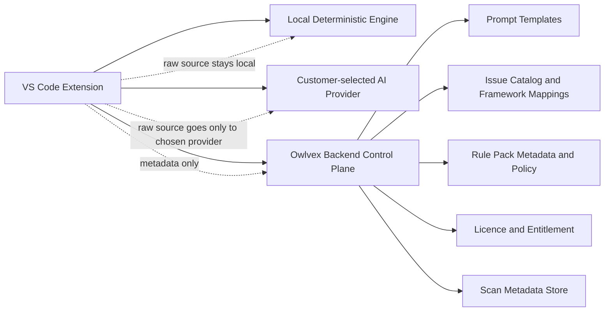
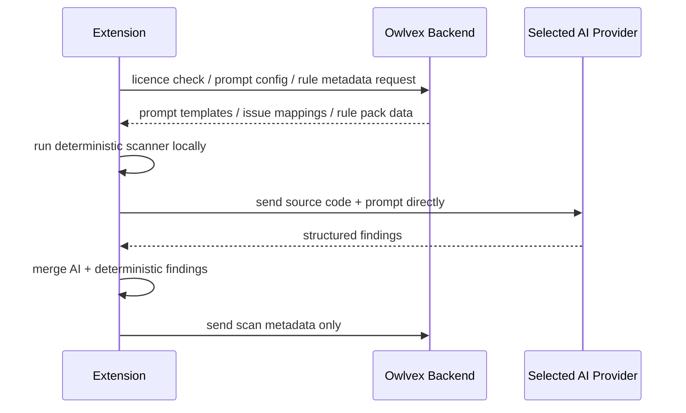

# Owlvex Implementation Design

This document is the authoritative build design for Owlvex.

It is written to be executable as an engineering contract:

- humans should be able to implement from it
- AI coding agents should be able to follow it without guessing
- future work should be checked against it before architecture changes are made

If another document conflicts with this one, treat this document as the source of truth for product architecture and system boundaries.

For the operational dev/prod deployment model that implements this boundary, see [DEPLOYMENT_ENVIRONMENTS.md](D:/Dev/repos/CodeScanner/docs/DEPLOYMENT_ENVIRONMENTS.md).

## 1. Product Goal

Owlvex is a developer-first security product that combines:

- local deterministic code analysis
- optional AI-assisted reasoning
- backend-served grounded data and rule intelligence
- structured reporting and benchmark-backed release confidence

The product must preserve two properties at the same time:

1. customer code stays under customer control
2. Owlvex retains meaningful control over its detection intelligence and product behavior

## 2. Non-Negotiable Boundaries

### 2.1 Customer Code Boundary

Owlvex backend services must not require raw source code in order to perform their role.

Allowed:

- extension reads and scans source code locally
- extension sends source code directly to the customer-selected AI provider
- extension sends metadata to Owlvex backend

Not allowed:

- sending source code to Owlvex backend for scanning
- proxying model calls through Owlvex backend when those calls contain source code
- logging raw source code in backend logs
- storing source code in Owlvex backend databases

### 2.2 Owlvex IP Boundary

We should not assume shipped extension code is secret.

Therefore:

- the extension may contain local execution runtime
- the extension may contain baseline deterministic logic
- high-value evolving rule intelligence should be delivered through backend-served rule/config data where practical

The protection model is:

- local execution for privacy
- backend-served grounded rule/config packs for updateability and IP leverage

## 3. Target Architecture



## 4. Component Responsibilities

### 4.1 Extension

The extension is the scan execution plane.

It owns:

- reading local source files
- running deterministic scans locally
- requesting rule/config/prompt data from backend
- invoking the customer-selected model provider
- merging deterministic and AI findings
- rendering findings, diagnostics, reports, comparisons, and advisory chat guidance
- proposing review-first remediation diffs when a user asks Owlvex to help change code
- expanding AI context beyond the active file when the finding or remediation depends on nearby project structure

It must not:

- silently upload source code to Owlvex backend
- depend on Owlvex backend to parse source code
- treat backend availability as permission to cross the source-code boundary

### 4.2 Backend

The backend is the control plane.

It owns:

- licence validation
- entitlement and plan enforcement
- prompt construction inputs and templates
- issue catalog and framework mapping delivery
- rule metadata and versioning
- benchmark/report metadata storage
- billing/admin/reporting support

It must not:

- become the source-code scan executor
- require raw source code to return prompt or rule data
- proxy source-bearing requests to model providers

### 4.3 Deterministic Engine

The deterministic engine is local-first and benchmark-backed.

It owns:

- structural invariant detection
- benchmark-verified correctness for covered rules
- provenance-strong findings with explicit rule codes

It must remain:

- deterministic
- explainable
- benchmark-gated
- separate from heuristic AI output

### 4.4 AI Provider Layer

The AI provider is customer-selected.

Supported deployment modes:

- local model, such as Ollama
- on-prem model gateway
- customer-managed cloud model endpoint

Owlvex does not require hosting the model itself.

## 5. Data Flow Rules

### 5.1 Allowed Flow



### 5.2 Forbidden Flow

```text
Extension -> Owlvex Backend -> source code for analysis
Extension -> Owlvex Backend -> provider proxy containing source code
Backend -> database/logs -> raw source code
```

## 6. Rule Intelligence Delivery Model

The target model is backend-served grounded intelligence with local execution.

### 6.1 What the backend should serve

- issue catalog
- framework mappings
- remediation text and policy metadata
- prompt templates
- signed or versioned rule metadata/config packs
- release and benchmark metadata

### 6.2 What the extension should execute locally

- source parsing
- local deterministic rule runtime
- local structural evaluation
- local merge of deterministic and AI findings

### 6.3 Design principle

The backend may send:

- data
- metadata
- config
- policies

The backend must not need to receive:

- raw code

## 7. Deterministic Engine Design

The deterministic engine is organized into layered axes.

Currently established:

- execution-risk
- SQL query safety
- access-control
- conditional rules group

Every deterministic axis must follow the same pattern:

1. contract document
2. corpus coverage plan
3. corpus fixtures with expected outputs
4. per-layer evaluators
5. integration evaluator
6. aggregate gate
7. confidence/status reporting

No new deterministic axis should be added without all of the above.

## 8. Product Output Contract

The product must distinguish clearly between:

- deterministic findings
- AI findings

Required properties on surfaced findings:

- provenance
- rule code when deterministic
- severity
- explanation
- canonical issue mapping where available

Users must be able to tell:

- what is proven
- what is inferred

Output surfaces should stay intentionally distinct:

- reports are concise scan artifacts focused on factual findings, remediation guidance, and scan errors/warnings
- advisory chat is the surface for plain-language fix explanations and concrete replacement code when a user asks for help remediating a finding
- remediation edits, when introduced, must remain review-first: Owlvex may generate candidate code changes and diffs, but must not silently rewrite files without explicit user approval

AI-assisted reasoning should use progressive context expansion:

- file-only context is the fast default path
- when imports, helper resolution, framework wiring, or data flow cross file boundaries, the extension should gather nearby project context before presenting stronger AI conclusions or remediation proposals
- higher-risk or ambiguous remediation guidance should prefer expanded context over isolated single-file guesses

## 9. Security and Privacy Requirements

### 9.1 Client-Side Source Protection

The extension must:

- minimize local persistence of code-derived artifacts
- avoid logging raw source
- avoid hidden uploads
- store secrets in OS-backed secure storage where possible
- make outbound providers explicit in config/UI

### 9.2 Backend Protection

The backend must:

- store metadata only
- protect secrets and credentials
- log safely without source content
- expose clear API boundaries

### 9.3 Enterprise Control Requirements

The architecture should support:

- local-only model mode
- approved provider allowlists
- backend-only metadata retention
- customer-controlled AI endpoints

## 10. Implementation Phases

### Phase A: Preserve and Harden Current Model

- keep deterministic execution local
- keep backend source-code-free
- align docs and code with the current boundary

### Phase B: Backend-Served Rule and Config Packs

- version rule/config payloads from backend
- cache locally in extension
- validate compatibility before use

### Phase C: Product Integration Hardening

- align benchmark outputs with extension/report outputs
- add CI gates
- strengthen release rules
- add controlled remediation discussion and patch-generation flows that stay grounded in findings and require explicit apply/approve steps
- add progressive project-context expansion for AI reasoning and remediation flows so single-file analysis is the default, not the maximum context path

### Phase D: Coverage And Claim Maintenance

- keep benchmark-backed claims, confidence docs, and product wording aligned as deterministic coverage evolves
- add more deterministic axes
- grow issue catalog and framework mapping depth

## 11. Acceptance Criteria

The architecture is being followed correctly if all of the following are true:

- source code is not sent to Owlvex backend
- deterministic findings can be produced locally without backend seeing code
- AI calls are provider-direct from extension
- benchmark gate remains green for covered axes
- product UI distinguishes deterministic from AI findings
- backend APIs remain metadata/control-plane oriented
- any future code-edit flow remains local/review-first and does not require source upload to Owlvex backend
- AI-assisted reasoning can expand beyond the active file when project context is necessary for trustworthy conclusions

## 12. Guidance For AI Coding Agents

When implementing against this design:

1. do not introduce backend endpoints that accept raw source for scanning
2. do not move deterministic evaluation into backend services
3. do not blur deterministic and AI findings into one unlabelled output
4. prefer local execution plus backend-served config/rule metadata
5. preserve benchmark-first discipline for any new deterministic capability
6. preserve explicit provenance in user-facing outputs
7. if implementing remediation edits, make them review-first and approval-gated rather than silent auto-edits
8. do not assume the active file is sufficient AI context when imports, shared helpers, or framework wiring clearly affect the conclusion

If a requested change would violate the source-code boundary or the local-execution model, stop and call that out explicitly.

## 13. Bottom Line

This is the Owlvex build direction:

> **Local execution, backend-served intelligence, customer-controlled model boundary, benchmark-backed deterministic trust.**
