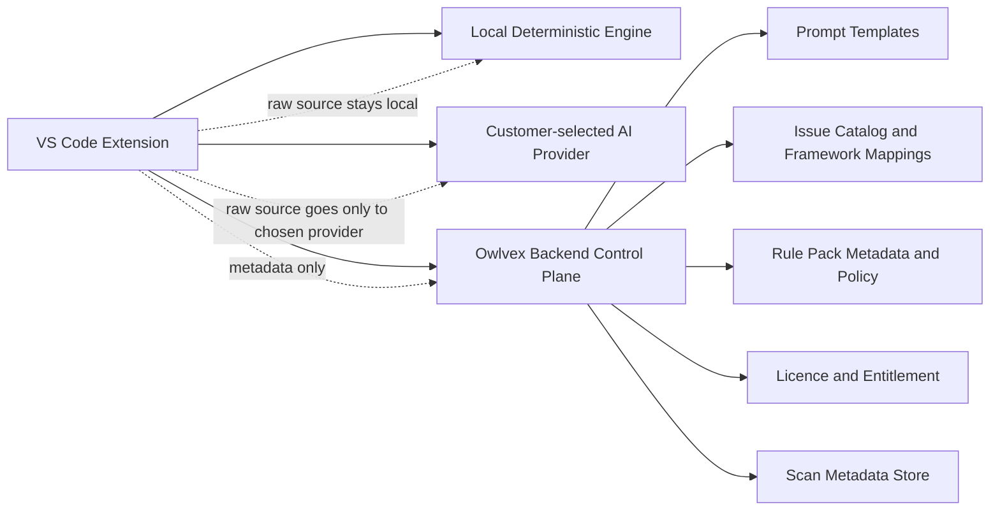
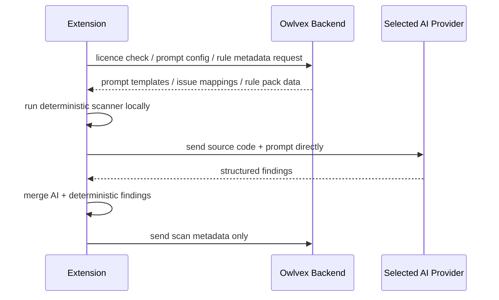

# Owlvex Implementation Design

This document is the authoritative build design for Owlvex.

It is written to be executable as an engineering contract:

- humans should be able to implement from it
- AI coding agents should be able to follow it without guessing
- future work should be checked against it before architecture changes are made

If another document conflicts with this one, treat this document as the source of truth for product architecture and system boundaries.

For the operational dev/prod deployment model that implements this boundary, see [DEPLOYMENT_ENVIRONMENTS.md](D:/Dev/repos/CodeScanner/docs/DEPLOYMENT_ENVIRONMENTS.md).

## 1. Product Goal

Owlvex is a developer-first security product that combines:

- local deterministic code analysis
- optional AI-assisted reasoning
- single-model multi-pass corroboration for AI-backed claims
- backend-served grounded data and rule intelligence
- structured reporting and benchmark-backed release confidence

The product must preserve two properties at the same time:

1. customer code stays under customer control
2. Owlvex retains meaningful control over its detection intelligence and product behavior

## 2. Non-Negotiable Boundaries

### 2.1 Customer Code Boundary

Owlvex backend services must not require raw source code in order to perform their role.

Allowed:

- extension reads and scans source code locally
- extension sends source code directly to the customer-selected AI provider
- extension sends metadata to Owlvex backend

Not allowed:

- sending source code to Owlvex backend for scanning
- proxying model calls through Owlvex backend when those calls contain source code
- logging raw source code in backend logs
- storing source code in Owlvex backend databases

### 2.2 Owlvex IP Boundary

We should not assume shipped extension code is secret.

Therefore:

- the extension may contain local execution runtime
- the extension may contain baseline deterministic logic
- high-value evolving rule intelligence should be delivered through backend-served rule/config data where practical

The protection model is:

- local execution for privacy
- backend-served grounded rule/config packs for updateability and IP leverage

## 3. Target Architecture



## 4. Component Responsibilities

### 4.1 Extension

The extension is the scan execution plane.

It owns:

- reading local source files
- running deterministic scans locally
- requesting rule/config/prompt data from backend
- invoking the customer-selected model provider
- merging deterministic and AI findings
- running multi-pass AI corroboration when enabled, using separate finder / verifier / skeptic instructions against the same selected model
- treating Owlvex canonical issues and local reasoning as the primary decision boundary
- rendering findings, diagnostics, reports, comparisons, and advisory chat guidance
- proposing review-first remediation diffs when a user asks Owlvex to help change code
- expanding AI context beyond the active file when the finding or remediation depends on nearby project structure

It must not:

- silently upload source code to Owlvex backend
- depend on Owlvex backend to parse source code
- treat backend availability as permission to cross the source-code boundary

### 4.2 Backend

The backend is the control plane.

It owns:

- licence validation
- entitlement and plan enforcement
- prompt construction inputs and templates
- issue catalog and framework mapping delivery
- rule metadata and versioning
- benchmark/report metadata storage
- billing/admin/reporting support

It must not:

- become the source-code scan executor
- require raw source code to return prompt or rule data
- proxy source-bearing requests to model providers

### 4.3 Deterministic Engine

The deterministic engine is local-first and benchmark-backed.

It owns:

- structural invariant detection
- benchmark-verified correctness for covered rules
- provenance-strong findings with explicit rule codes

It must remain:

- deterministic
- explainable
- benchmark-gated

### 4.4 AI Verification Layer

The AI lane should not rely on a single unconstrained pass when product trust depends on corroboration.

The target engine direction is **evidence-first scanning**:

1. discover security-relevant sinks locally
2. classify source, sink, and visible guard posture
3. run safe non-executing probe logic where the family is supported
4. send AI only the unresolved or context-sensitive reasoning problem
5. run verifier/skeptic only when the result can still change

This replaces the older mental model of "ask AI to review the file, then validate what it says." Owlvex should increasingly behave as a local evidence engine that uses AI for gaps in proof, not as a generic AI code reviewer.

The current first implementation step is a pre-AI local sink inventory. Finder prompts receive the locally discovered sinks, visible guards, and probe hints before the raw file. The Finder should start from that evidence map and avoid broad claims that are not tied to concrete local behavior.

For probeable families, the sink inventory is also an adjudication input. An AI candidate for SSRF, SQL injection, command injection, path traversal, JWT validation, open redirect, insecure deserialization, CORS misconfiguration, CSRF, sensitive logging, debug exposure, object authorization, privileged actions, mass assignment, NoSQL injection, audit gaps, or PII overexposure should not advance to verifier/skeptic unless the local inventory contains the corresponding sink family in that file. This is intentionally conservative: non-probeable families still follow the existing AI corroboration path until local evidence models exist for them.

Probeable AI candidates should then run safe probes before verifier/skeptic. The engine should spend corroboration calls only after local source/sink/guard evidence fails to resolve the candidate. This means:

- unsupported or counter-evidence probe outcomes can drop the candidate before verifier
- confirmed probe outcomes can be promoted or kept without verifier when confidence routing allows
- inconclusive/manual-review outcomes may still go through verifier/skeptic
- post-corroboration probes remain as a fallback when earlier routing did not resolve the finding

Safe probes can also receive bounded helper context from relative imports and requires. Related files are used to resolve guards, allowlists, wrappers, and policy helper evidence. They do not create findings by themselves: the candidate sink must still be present in the scanned file before related helper code can influence the probe verdict.

Each scan should also emit metadata-safe engine telemetry for this evidence-first path:

- how many sinks were found before AI
- which sink families were present
- how many sinks had visible guards, missing guards, or unknown guard posture
- how many AI candidates survived static filtering, sink gating, pre-corroboration probes, and corroboration
- how many safe probes confirmed, contradicted, dropped, or left a finding for manual review

This telemetry is product-critical because it turns false-positive reduction and AI-cost reduction into measurable release criteria.

### 4.4.1 Action Gating

Owlvex must not present every finding with the same user action.

The action surface is part of the evidence contract:

- **Fix First** findings may offer `Preview fix`
- **Possible Extra** findings should offer investigation actions first, such as `Trace caller path`, `Find callers`, or `Verify reachability`
- **Finder-only** findings should offer `Verify with reviewer` before code changes when the issue is high impact or helper-layer only
- **helper/repository sink** findings should resolve caller context before fix-preview is treated as the primary action
- **deterministic/proof-promoted** findings can skip caller-path investigation only when the rule already proves reachability in the scanned scope

The rule is: Owlvex should not push a user toward editing code when the engine itself says the issue is an unproven extra or a helper-layer risk whose exploitability depends on callers.

### 4.4.2 Caller-Path Dynamics

For helper-layer findings, especially repositories, services, policy helpers, and shared utility functions, Owlvex should ask a caller-path question before promotion:

1. who calls the risky function?
2. does attacker-controlled input reach the call?
3. is authentication, authorization, tenant scope, value allowlisting, or object ownership enforced before the call?
4. is the risky function exposed only behind a safe wrapper?
5. does a safe companion route or policy helper prove the expected guard pattern?

The caller-path verdict should affect posture:

- reachable unguarded caller path -> promote to Fix First
- reachable guarded caller path -> downgrade or keep clean with evidence
- helper sink with unknown callers -> Possible Extra / manual review
- no caller path found in project scope -> Possible Extra, not Fix First
- mixed guarded and unguarded callers -> promote only the unsafe caller path and name it in the report

Caller-path analysis should prefer bounded project context over isolated single-file assumptions. For mixed callers, Owlvex must carry the unsafe caller list into the report and fix workflow so remediation is anchored to the reachable unguarded boundary, not blindly applied to every helper caller.

### 4.4.3 Confidence Routing

Finder confidence is not enough by itself to decide whether a finding should trigger remediation.

Default routing rules:

- low finder confidence -> verifier
- finder/verifier disagreement -> skeptic
- high confidence + low impact + route-local evidence -> verifier can be skipped
- high confidence + high impact + route-level sink -> verifier or safe probe should run unless deterministic evidence already proves the issue
- high confidence + high impact + helper-layer sink -> caller-path verifier should run before promotion
- safe-probe confirmed path -> verifier can be skipped when the finding is already locally supported
- safe-probe counter-evidence or unsupported path -> downgrade/drop before spending corroboration calls

Reports and advisory answers must show when verifier or skeptic were skipped and why.

### 4.4.4 Fix Continuation

After a user chooses `Keep fix`, Owlvex should not treat the first clean single-file verification as the end of the workflow when the original fix touched multiple files or produced new findings.

Fix continuation should:

1. verify the anchored original finding
2. rescan every touched file
3. identify residual findings in the same family, same caller path, or newly introduced by the patch
4. continue remediation only for unresolved related findings
5. stop with an explicit state: resolved, partially resolved, downgraded to manual review, or still vulnerable

The product must avoid wording such as "fixed" or "clean" for the whole patch when only one file or one finding has been verified.

The intended verification direction is:

- one selected model may be used across multiple sequential passes
- passes must use distinct roles rather than one blended prompt
- disagreement is first-class evidence and must affect report posture

The default role set is:

1. `Finder`
   propose candidate issues

2. `Verifier`
   confirm candidates only when local code evidence supports them

3. `Skeptic`
   search for contradictory guards, safe patterns, missing sinks, or nearby evidence that weakens the claim

The merge layer must stay Owlvex-controlled. It should not outsource final adjudication to another free-form model response.

The deterministic engine is the primary detection truth for covered behaviors.
External frameworks may classify or map its output, but they must not silently redefine whether a structurally proven finding exists.

### 4.5 AI Provider Layer

The AI provider is customer-selected.

Supported deployment modes:

- local model, such as Ollama
- on-prem model gateway
- customer-managed cloud model endpoint

Owlvex does not require hosting the model itself.

The AI lane is the flexible reasoning layer for issue classes that deterministic coverage does not prove.
Selected frameworks may shape AI prioritization, classification, remediation style, and report vocabulary more directly than they shape deterministic findings.
This must not blur provenance: AI output remains confidence-scored and distinct from Owlvex-proven findings.

## 5. Data Flow Rules

### 5.1 Allowed Flow



### 5.2 Forbidden Flow

```text
Extension -> Owlvex Backend -> source code for analysis
Extension -> Owlvex Backend -> provider proxy containing source code
Backend -> database/logs -> raw source code
```

## 6. Rule Intelligence Delivery Model

The target model is backend-served grounded intelligence with local execution.

### 6.1 What the backend should serve

- issue catalog
- framework mappings
- remediation text and policy metadata
- prompt templates
- signed or versioned rule metadata/config packs
- release and benchmark metadata

For AI-assisted scanning, backend-served prompt data may encode selected framework scope more directly than deterministic runtime data does.
That is acceptable as long as Owlvex still owns the product contract around provenance, validation, and presentation.

### 6.2 What the extension should execute locally

- source parsing
- local deterministic rule runtime
- local structural evaluation
- local merge of deterministic and AI findings

### 6.3 Design principle

The backend may send:

- data
- metadata
- config
- policies

The backend must not need to receive:

- raw code

## 7. Deterministic Engine Design

The deterministic engine is organized into layered axes.

Currently established:

- execution-risk
- SQL query safety
- access-control
- conditional rules group

Every deterministic axis must follow the same pattern:

1. contract document
2. corpus coverage plan
3. corpus fixtures with expected outputs
4. per-layer evaluators
5. integration evaluator
6. aggregate gate
7. confidence/status reporting

No new deterministic axis should be added without all of the above.

## 8. Product Output Contract

The product must distinguish clearly between:

- deterministic findings
- AI findings
- Owlvex-native detection truth
- external framework interpretation

Required interpretation rule:

- deterministic findings remain Owlvex-grounded even when frameworks are selected
- AI findings may be more framework-guided, especially for uncovered issue classes
- changing framework scope should change AI emphasis more readily than deterministic truth

Required properties on surfaced findings:

- provenance
- rule code when deterministic
- severity
- explanation
- canonical issue mapping where available

Users must be able to tell:

- what is proven
- what is inferred
- what comes from Owlvex reasoning
- what comes from framework mapping, threat-modeling, or compliance interpretation

Output surfaces should stay intentionally distinct:

- reports are concise scan artifacts focused on factual findings, remediation guidance, and scan errors/warnings
- advisory chat is the surface for plain-language fix explanations and concrete replacement code when a user asks for help remediating a finding
- remediation edits, when introduced, must remain review-first: Owlvex may generate candidate code changes and diffs, but must not silently rewrite files without explicit user approval

AI-assisted reasoning should use progressive context expansion:

- file-only context is the fast default path
- when imports, helper resolution, framework wiring, or data flow cross file boundaries, the extension should gather nearby project context before presenting stronger AI conclusions or remediation proposals
- higher-risk or ambiguous remediation guidance should prefer expanded context over isolated single-file guesses

Framework selection semantics should remain explicit:

- Owlvex is the scan engine and canonical issue source of truth
- selected frameworks shape prompt context, mappings, output labels, and interpretation
- selected frameworks may shape AI-only reasoning more strongly than deterministic findings
- framework selection should not be described as if OWASP, CWE, STRIDE, NIST, PCI DSS, and Clean Code are interchangeable scan engines
- if future work introduces framework-specific gating, it must be an explicit product decision with user-visible semantics rather than an implicit side effect

## 9. Security and Privacy Requirements

### 9.1 Client-Side Source Protection

The extension must:

- minimize local persistence of code-derived artifacts
- avoid logging raw source
- avoid hidden uploads
- store secrets in OS-backed secure storage where possible
- make outbound providers explicit in config/UI

### 9.2 Backend Protection

The backend must:

- store metadata only
- protect secrets and credentials
- log safely without source content
- expose clear API boundaries

### 9.3 Enterprise Control Requirements

The architecture should support:

- local-only model mode
- approved provider allowlists
- backend-only metadata retention
- customer-controlled AI endpoints

## 10. Implementation Phases

### Phase A: Preserve and Harden Current Model

- keep deterministic execution local
- keep backend source-code-free
- align docs and code with the current boundary

### Phase B: Backend-Served Rule and Config Packs

- version rule/config payloads from backend
- cache locally in extension
- validate compatibility before use

### Phase C: Product Integration Hardening

- align benchmark outputs with extension/report outputs
- add CI gates
- strengthen release rules
- add controlled remediation discussion and patch-generation flows that stay grounded in findings and require explicit apply/approve steps
- add progressive project-context expansion for AI reasoning and remediation flows so single-file analysis is the default, not the maximum context path
- gate user actions by evidence posture so Possible Extra and helper-layer findings ask for caller-path investigation before fix preview
- add fix-continuation behavior after `Keep fix` so touched files and related findings are rechecked before the product claims resolution

### Phase D: Coverage And Claim Maintenance

- keep benchmark-backed claims, confidence docs, and product wording aligned as deterministic coverage evolves
- add more deterministic axes
- grow issue catalog and framework mapping depth

## 11. Acceptance Criteria

The architecture is being followed correctly if all of the following are true:

- source code is not sent to Owlvex backend
- deterministic findings can be produced locally without backend seeing code
- AI calls are provider-direct from extension
- benchmark gate remains green for covered axes
- product UI distinguishes deterministic from AI findings
- product UI and docs distinguish Owlvex detection truth from framework interpretation
- backend APIs remain metadata/control-plane oriented
- any future code-edit flow remains local/review-first and does not require source upload to Owlvex backend
- AI-assisted reasoning can expand beyond the active file when project context is necessary for trustworthy conclusions

## 12. Guidance For AI Coding Agents

When implementing against this design:

1. do not introduce backend endpoints that accept raw source for scanning
2. do not move deterministic evaluation into backend services
3. do not blur deterministic and AI findings into one unlabelled output
4. prefer local execution plus backend-served config/rule metadata
5. preserve benchmark-first discipline for any new deterministic capability
6. preserve explicit provenance in user-facing outputs
7. if implementing remediation edits, make them review-first and approval-gated rather than silent auto-edits
8. do not assume the active file is sufficient AI context when imports, shared helpers, or framework wiring clearly affect the conclusion
9. do not treat external frameworks as interchangeable detection engines unless the product contract is deliberately being changed and documented

If a requested change would violate the source-code boundary or the local-execution model, stop and call that out explicitly.

## 13. Bottom Line

This is the Owlvex build direction:

> **Local execution, backend-served intelligence, customer-controlled model boundary, benchmark-backed deterministic trust.**
