# Owlvex Product Map

This document maps what Owlvex has achieved so far, what is currently in progress, and what still needs to exist before this becomes a full product rather than a strong internal engine foundation.

The important framing is:

- Owlvex has two product-grade deterministic reasoning axes
- Owlvex has a real benchmark and release-gate tool covering both axes
- Owlvex is not yet a complete product because the benchmarked engine is only partially integrated into the wider scanner, reporting, and user workflow

## Current State

### What Exists Today

#### Benchmark and Evaluation

- dedicated benchmark tool in `tools/owlvex-benchmark/`
- model benchmark manifest, importer, scorer, and SSH runner
- repeatable benchmark result format
- release-confidence guidance with per-axis status
- deterministic run history and release status command
- `benchmark:status` reports overall and per-axis confidence

#### Execution-Risk Axis — Complete

- `GR-002`: trust propagation
- `GR-003`: explicit trust transformation
- `GR-004`: sink identification and execution semantics
- `GR-005`: context validation
- `GR-001`: final execution-risk policy decision
- cross-layer integration coverage — 5 integration cases
- canonical deterministic finding shape and normalizer
- aggregate deterministic gate — 35/35 cases passing

#### SQL Query Axis — Complete

- `SQ-002`: trust propagation for SQL-bound variables
- `SQ-003`: SQL transformation detection (parameterized vs HTML/generic)
- `SQ-004`: query sink shape identification
- `SQ-005`: SQL context validation (overrides trust when transformation is not SQL-safe)
- `SQ-001`: final SQL-injection policy decision (delegates to SQ-005)
- cross-layer integration coverage — 5 integration cases
- canonical SQL finding shape and normalizer
- SQL gate included in aggregate deterministic run — 22/22 cases passing

#### Deterministic Gate Total

- 12 suites, 57 cases, 57 passing
- both axes `high-for-covered-axis` confidence

#### Existing Product Surface In Repo

- extension UI and commands already exist
- backend services and API routes already exist
- golden corpus and canonical issue catalog already exist (30 issues)

## What This Means

Owlvex is now:

- beyond idea stage
- beyond prototype stage
- beyond "defensible subsystem" stage — now at "two defensible subsystems"

Owlvex is not yet:

- a fully integrated deterministic security product
- broad enough across vulnerability axes
- complete enough in reporting, CI, release policy, and user-facing explanation to claim full product maturity

## Remaining Work To Reach Product

### 1. Integrate Deterministic Findings Into The Scanner Flow

- connect benchmark-backed deterministic outputs into the real extension/backend scan pipeline
- align deterministic findings with report generation
- make benchmark-backed findings visible in actual scan results

### 2. Normalize Product Output

- adopt one canonical finding schema across:
  - deterministic engine output (normalizers exist for both axes)
  - model-backed findings
  - report generation
  - extension display

### 3. Expand Coverage Beyond Two Axes

Likely next candidates:

- access control / authorization misuse
- data protection / sensitive logging
- secrets exposure
- identity/auth weakness

### 4. Operationalize Release Discipline

- run benchmark and deterministic gates in CI
- define promotion thresholds for models
- track benchmark performance over time
- define versioned "supported claims" for each covered axis

### 5. Strengthen Product UX

- show confidence and provenance in findings
- explain why a finding was produced or suppressed
- expose deterministic vs model-assisted reasoning clearly
- present remediation in a user-friendly way

### 6. Build Product Trust

- broaden corpus size and adversarial cases
- compare multiple models against the same benchmark
- demonstrate stable performance across releases
- document what Owlvex can and cannot claim confidently

## Mermaid Map

```mermaid
flowchart TD
    A[Owlvex Today] --> B[Benchmark Foundation]
    A --> C[Deterministic Engine]
    A --> D[Existing Product Surface]
    A --> E[Remaining Product Gaps]

    subgraph B1[Benchmark Foundation]
        B --> B2[Model manifest and scorer]
        B --> B3[Import and SSH run tooling]
        B --> B4[Per-axis release confidence]
        B --> B5[Persistent run artifacts]
        B --> B6[benchmark:status per-axis signal]
    end

    subgraph C1[Deterministic Engine]
        C --> C2[Execution-Risk Axis Complete]
        C --> C3[SQL Query Axis Complete]
    end

    subgraph C2A[Execution-Risk Axis]
        C2 --> C21[GR-002 Trust]
        C2 --> C22[GR-003 Transformation]
        C2 --> C23[GR-004 Sink Shape]
        C2 --> C24[GR-005 Context Validation]
        C2 --> C25[GR-001 Final Policy]
        C2 --> C26[Integration Corpus 5 cases]
        C2 --> C27[Gate 35/35 Passing]
    end

    subgraph C3A[SQL Query Axis]
        C3 --> C31[SQ-004 Sink Shape]
        C3 --> C32[SQ-002 Trust]
        C3 --> C33[SQ-003 Transformation]
        C3 --> C34[SQ-005 Context Validation]
        C3 --> C35[SQ-001 Final Policy]
        C3 --> C36[Integration Corpus 5 cases]
        C3 --> C37[Gate 22/22 Passing]
    end

    subgraph D1[Existing Product Surface]
        D --> D2[VS Code extension]
        D --> D3[Backend services and API]
        D --> D4[Golden corpus]
        D --> D5[Issue catalog 30 issues]
    end

    subgraph E1[What Still Needs To Exist]
        E --> E2[Integrate deterministic findings into scan pipeline]
        E --> E3[Canonical finding schema across product]
        E --> E4[Additional reasoning axes]
        E --> E5[CI and release gates]
        E --> E6[User-facing confidence and explanation]
        E --> E7[Broader benchmark coverage and model comparison]
    end

    E2 --> F[Product-Ready Core]
    E3 --> F
    E4 --> F
    E5 --> F
    E6 --> F
    E7 --> F

    F --> G[Owlvex Product]
    G --> G1[Benchmark-backed]
    G --> G2[Deterministic where trust matters]
    G --> G3[Model-assisted where breadth matters]
    G --> G4[Integrated into extension, backend, and reporting]
```

## Suggested Product Milestones

### Milestone 1: Second Axis Complete ✅

- SQL deterministic axis reaches the same maturity level as execution risk
- SQL aggregate deterministic gate exists and passes

### Milestone 2: Product Integration

- deterministic findings appear in the real scan and report flow
- canonical finding schema is shared across layers

### Milestone 3: Product Confidence

- CI gates benchmark and deterministic results
- model promotion rules are defined
- confidence claims are explicit in documentation and output

### Milestone 4: Broader Product Coverage

- at least 3 to 5 major reasoning axes are covered with the same discipline

## Bottom Line

Owlvex is no longer "just an AI scanner idea."

It is now a benchmark-backed, deterministic security reasoning system across two complete axes.

The remaining work is less about proving the architecture can work, and more about:

- integrating the deterministic engine into the actual product flow
- expanding the same discipline across more axes
- making the resulting claims visible, explainable, and enforceable
